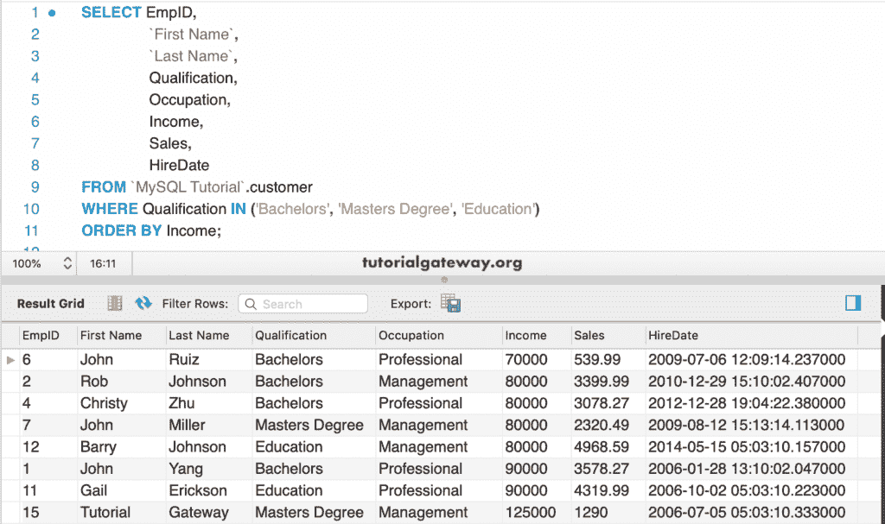

# MySQL `IN`运算符

> 原文：<https://www.tutorialgateway.org/mysql-in-operator/>

MySQL `IN`运算符用于限制`SELECT`语句返回的总行数。MySQL `IN`运算符根据给定表达式中的值来检查该表达式。如果至少有一个匹配，则`SELECT`语句返回记录。请使用 MySQL `IN`运算符根据多个值检查表达式或条件。

## 运算符语法

MySQL `IN`运算符的基本语法可以写成:

```sql
SELECT [Column Names] 
FROM [Source] 
WHERE [Column_Name] IN (Value1,...., ValueN) 

-- Use OR to write the above statement 
SELECT [Column Names] 
FROM [Source] 
WHERE [Column_Name] = Value1 OR [Column_Name] = ValueN 
```

对于这个 MySQL IN Operator 的例子，我们使用的是下面显示的数据


## 运算符示例

在这个例子中，我们使用这个 MySQL `IN`运算符来检查数值。

```sql
SELECT 3 IN (1, 2, 3, 4, 5);

SELECT 6 IN (1, 2, 3, 4, 5);

SELECT 3.5 IN (1, 2, 3, 4, 5);
```


让我用 `IN`运算符检查字符串数据。在第三个语句中，我们使用了混合值。在实时情况下，这可能会产生奇怪的结果，所以总是在其中使用单个数据类型。

```sql
SELECT 'abc' IN ('xyz', 'hi', 'abc', 'ab');

SELECT 'a' IN ('xyz', 'hi', 'abc', 'ab');

SELECT 4 IN (1, 3, 4, '5');
```


我们必须使用任何单一的 [MySQL](https://www.tutorialgateway.org/mysql-tutorial/) 类型，而不是使用混合值。因此，[选择声明](https://www.tutorialgateway.org/mysql-select-statement/)给出了一个准确的结果。

```sql
SELECT 4 IN ('1',' 3', '4', '5');

SELECT (10, 20) IN ((1,2), (10, 20), (100, 200));

SELECT 3 IN (1, 3, NULL, 4);
```


## 运算符实例

以下查询查找收入为 80000 或 90000 的客户

```sql
SELECT EmpID, 
       `First Name`,
       `Last Name`,
       Qualification,
       Occupation,
       Income,
       Sales,
       HireDate
 FROM customer
 WHERE Income IN (80000, 90000);
```


为了更好的理解，让我再给你看一个例子。以下查询返回收入为 50000、80000 或 90000 

```sql
SELECT EmpID, 
       `First Name`,
       `Last Name`,
       Qualification,
       Occupation,
       Income,
       Sales,
       HireDate
 FROM customer
 WHERE Income IN (50000, 80000, 90000);
```


### 字符串示例中的 MySQL

这次，我们使用的是字符串数据。以下查询查找资格为学士学位或硕士学位的客户。

```sql
SELECT EmpID, 
       `First Name`,
       `Last Name`,
       Qualification,
       Occupation,
       Income,
       Sales,
       HireDate
 FROM customer
 WHERE Qualification IN ('Bachelors', 'Masters Degree');
```


### 按子句排序的 MySQL

您也可以将 [`ORDER BY`子句](https://www.tutorialgateway.org/mysql-order-by/)与此子句一起使用。此查询返回其资格为学士、硕士或教育的客户。接下来，`ORDER BY`子句根据收入以升序对结果进行排序。

```sql
SELECT EmpID, 
       `First Name`,
       `Last Name`,
       Qualification,
       Occupation,
       Income,
       Sales,
       HireDate
 FROM customer
 WHERE Qualification IN ('Bachelors', 'Masters Degree', 'Education')
 ORDER BY Income;
```

