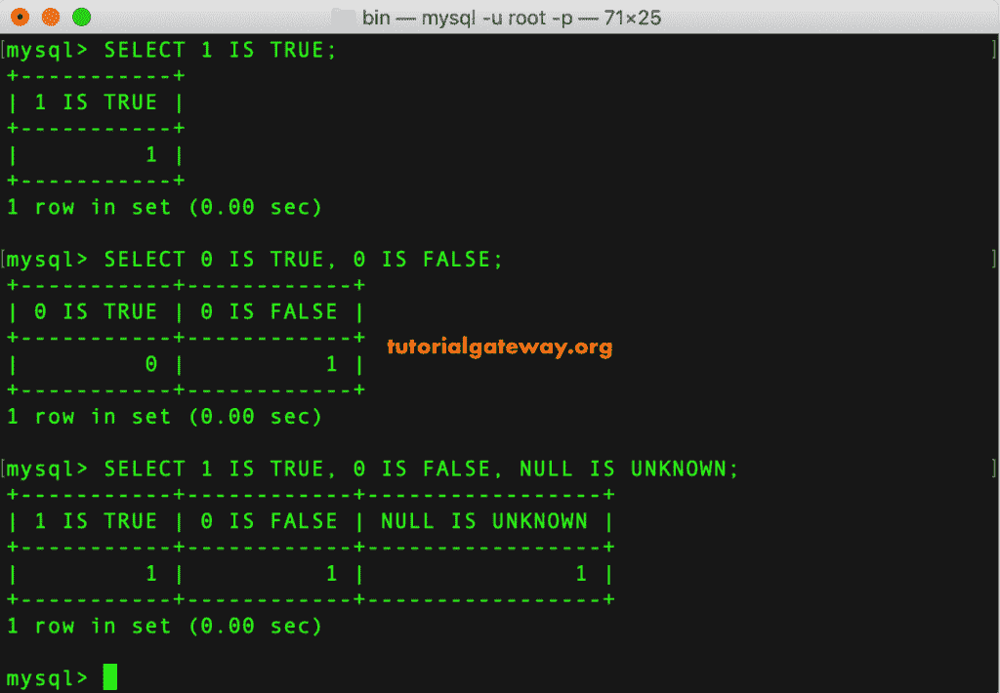

# MySQL `IS`运算符

> 原文：<https://www.tutorialgateway.org/mysql-is-operator/>

MySQL `IS`运算符可用于根据布尔值“真”、“假”和“未知”来测试给定的表达式或值。

## MySQL `IS`运算符示例

在这个 MySQL 是运算符的例子中，我们使用这个运算符检查数值和空值。

```sql
SELECT 1 IS TRUE;

SELECT 0 IS TRUE, 0 IS FALSE;

SELECT 1 IS TRUE, 0 IS FALSE, NULL IS UNKNOWN;
```



## MySQL `IS`运算符实例

以下是查询根据结果返回的 0 和 1。

```sql
SELECT EmpID, 
       `First Name`,
       `Last Name`,
       Qualification,
       Occupation,
       Income,
       Income IS TRUE,
       Income IS FALSE,
       Income IS UNKNOWN,
       Sales
FROM new_Customers;    
```


为了更好地理解，让我在`WHERE`子句中使用 MySQL `IS`运算符和 TRUE 关键字。它返回收入为真(正整数)的员工。

```sql
SELECT EmpID, 
       `First Name`,
       `Last Name`,
       Qualification,
       Occupation,
       Income,
       Sales,
       HireDate
 FROM customer
 WHERE Income IS TRUE;
```


这一次，我们使用了带有假关键字的 is。以下 [MySQL](https://www.tutorialgateway.org/mysql-tutorial/) 查询返回收入为 0 的客户。

```sql
SELECT EmpID, 
       `First Name`,
       `Last Name`,
       Qualification,
       Occupation,
       Income,
       Sales,
       HireDate
 FROM customer
 WHERE Income IS FALSE;
```


这里，我们使用了带有未知关键字的 IS。下面的信息系统运算符代码选择收入为空的员工。

```sql
SELECT EmpID, 
       `First Name`,
       `Last Name`,
       Qualification,
       Occupation,
       Income,
       Sales,
       HireDate
 FROM customer
 WHERE Income IS UNKNOWN;
```

