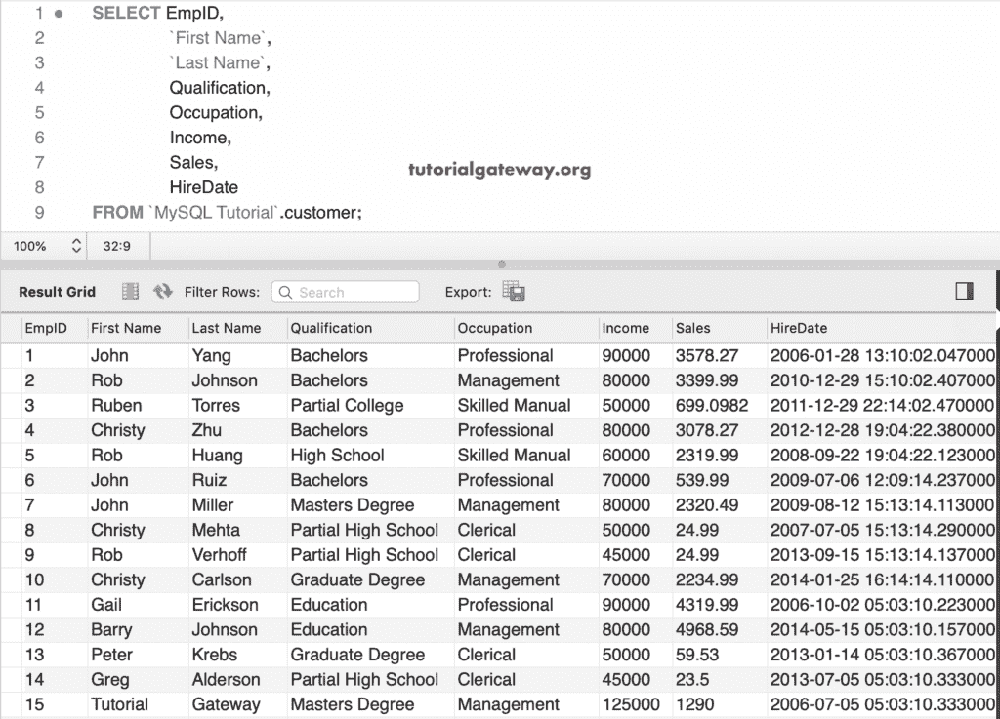
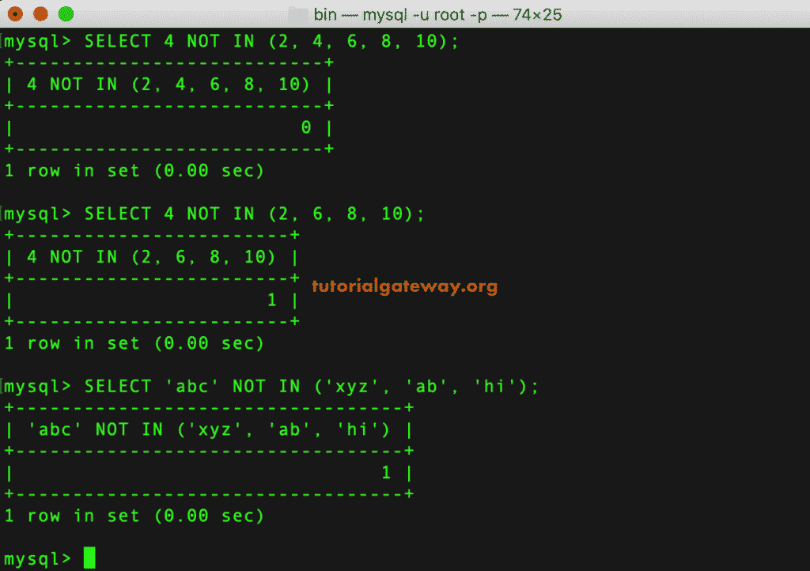
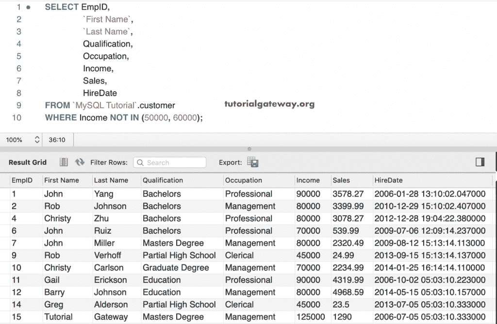
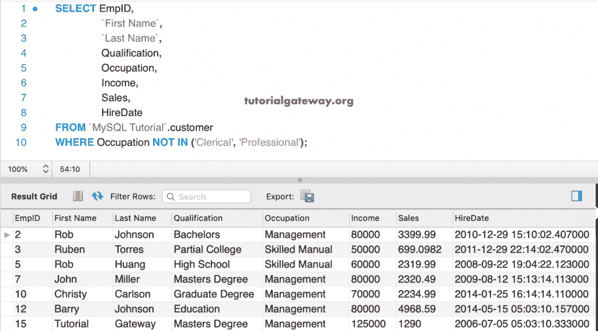
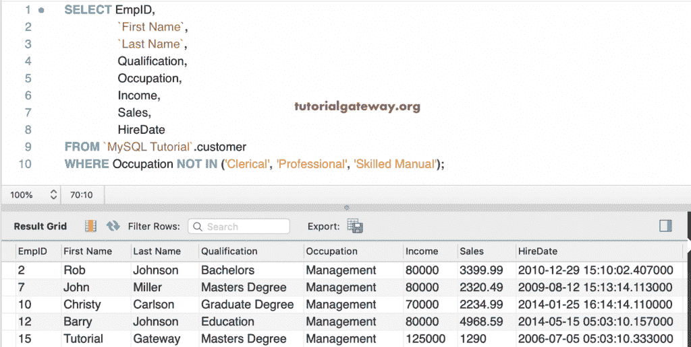

# MySQL 不在运算符中

> 原文：<https://www.tutorialgateway.org/mysql-not-in-operator/>

MySQL NOT IN 运算符用于根据值检查表达式。`SELECT`语句选择与 MySQL NOT IN 表达式中的值不匹配的记录。

非输入运算符与输入运算符完全相反。您可以将其称为非(表达式输入(值))。

## 不在运算符语法中

MySQL NOT IN 运算符的语法是

```
SELECT Columns
FROM Tables
WHERE Column_Name NOT IN (Value1,...., ValueN) 
```

对于 MySQL 不在演示中，我们使用的是下面显示的数据



## MySQL 不在运算符示例中

在本例中，我们检查数值和字符串数据是否存在。如果不是，则返回 1，否则返回 0。

```
SELECT 4 NOT IN (2, 4, 6, 8, 10);

SELECT 4 NOT IN (2, 6, 8, 10);

SELECT 'abc' NOT IN ('xyz', 'ab', 'hi'); 
```



### MySQL 不在运算符示例 2 中

以下不在查询中[选择](https://www.tutorialgateway.org/mysql-select-statement/)收入不在 50000 或 60000 的客户

```
SELECT EmpID, 
       `First Name`,
       `Last Name`,
       Qualification,
       Occupation,
       Income,
       Sales,
       HireDate
 FROM customer
 WHERE Income NOT IN (50000, 60000);
```



### 不在字符串中示例 3

这次，我们使用了非输入中的字符串数据。这个 [MySQL](https://www.tutorialgateway.org/mysql-tutorial/) 查询找到了职业不是文员和专业的客户。

```
SELECT EmpID, 
       `First Name`,
       `Last Name`,
       Qualification,
       Occupation,
       Income,
       Sales,
       HireDate
 FROM customer
 WHERE Occupation NOT IN ('Clerical', 'Professional');
```



此查询返回职业不是文书、专业和技术手册的客户。您也可以将 [Order By 子句](https://www.tutorialgateway.org/mysql-order-by/)与此 Not In 运算符一起使用。请参考示例文章中的[。](https://www.tutorialgateway.org/mysql-in-operator/)

```
SELECT EmpID, 
       `First Name`,
       `Last Name`,
       Qualification,
       Occupation,
       Income,
       Sales,
       HireDate
 FROM customer
 WHERE Occupation NOT IN ('Clerical', 'Professional', 'Skilled Manual');
```

