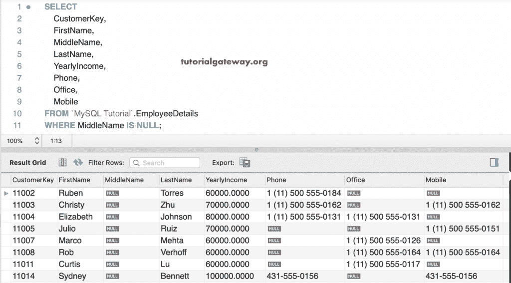

# MySQL 为空

> 原文：<https://www.tutorialgateway.org/mysql-is-null/>

MySQL 为空用于测试用户给定的表达式或列值是否为空。您可以在 Where 子句中使用这个`is()`函数来查找具有空值的记录。这个 MySQL 为空背后的基本语法如下:

```
SELECT Column_Names  
FROM Table_Name
WHERE Column_Value IS NULL
```

## 简单的 MySQL 为空示例

在本例中，我们向您展示了 MySQL IS 空运算符的简单示例。这里，1 不是，0 或空值是空值。在最后一条语句中，1/0 是空值。

```
SELECT 1 IS NULL;

SELECT 0 IS NULL, NULL IS NULL;

SELECT 1/0 IS NULL, 0/1 IS NULL;
```


在本演示中，我们将使用员工详细信息表。下面的截图展示了这张表


里面的数据

在这个例子中，我们使用这个 MySQL 为空来返回所有中间名为空值的员工详细信息。

```
SELECT 
       CustomerKey,
       FirstName, 
       MiddleName,
       LastName,
       YearlyIncome,
       Phone,
       Office,
       Mobile
 FROM EmployeeDetails
 WHERE MiddleName IS NULL;
```



以下 [MySQL](https://www.tutorialgateway.org/mysql-tutorial/) 查询返回所有电话号码为空的员工记录。

```
SELECT 
       CustomerKey,
       FirstName, 
       MiddleName,
       LastName,
       YearlyIncome,
       Phone,
       Office,
       Mobile
 FROM EmployeeDetails
 WHERE Phone IS NULL;
```


到目前为止，我们在单个列上使用这个 MySQL IS NULL。在本例中，我们使用该运算符返回所有员工的详细信息，其个人电话号码或办公室号码为空值

```
SELECT 
       CustomerKey,
       FirstName, 
       MiddleName,
       LastName,
       YearlyIncome,
       Phone,
       Office,
       Mobile
 FROM EmployeeDetails
 WHERE Phone IS NULL OR Office IS NULL;
```


在这里，我们找到了中间的员工，他们的电话号码为空。

```
SELECT 
       CustomerKey,
       FirstName, 
       MiddleName,
       LastName,
       YearlyIncome,
       Phone,
       Office,
       Mobile
 FROM EmployeeDetails
 WHERE MiddleName IS NULL AND Phone IS NULL;
```

