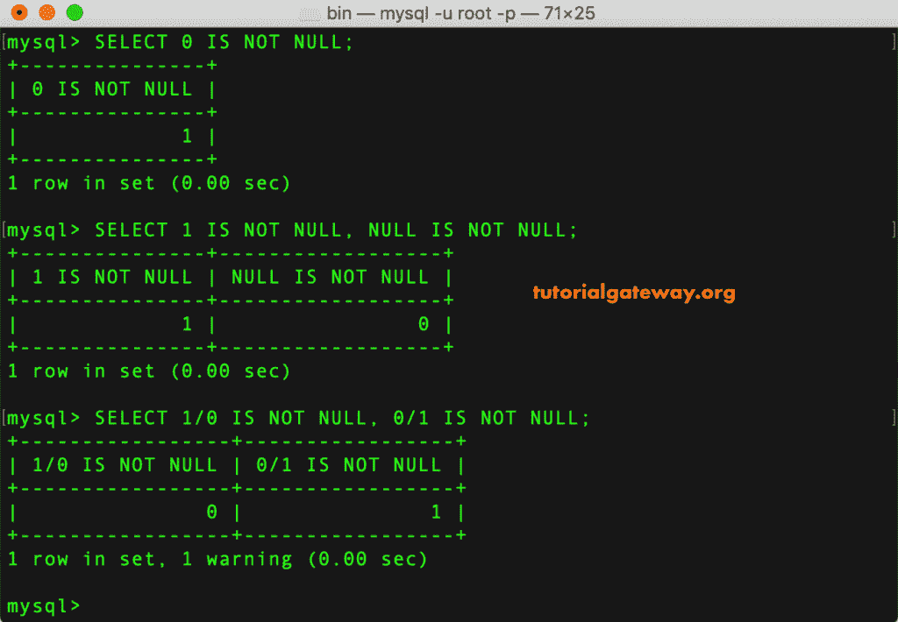

# MySQL 不是空的

> 原文：<https://www.tutorialgateway.org/mysql-is-not-null/>

MySQL 非空用于测试用户给定的表达式或列值是否为非空值。您可以在 Where 子句中使用此运算符来查找非空值的记录。

让我们看看如何使用这个例子，这个 MySQL 的语法不是空的，用于处理空的如下:

```
SELECT Column_Names  
FROM Tables_Name
WHERE Column_Value IS NOT NULL
```

## 简单的 MySQL 不为空示例 1

在本例中，我们向您展示了 MySQL IS NOT NULL 运算符的简单示例。

```
SELECT 0 IS NOT NULL;

SELECT 1 IS NOT NULL, NULL IS NOT NULL;

SELECT 1/0 IS NOT NULL, 0/1 IS NOT NULL;
```



在这个 MySQL 非空运算符演示中，我们将使用员工详细信息表。下面的截图显示了这个 [MySQL](https://www.tutorialgateway.org/mysql-tutorial/) 表


中的数据

在这个例子中，我们使用这个 MySQL 操作符来返回所有中间名不是空值的员工详细信息

```
SELECT 
       CustomerKey,
       FirstName, 
       MiddleName,
       LastName,
       YearlyIncome,
       Phone,
       Office,
       Mobile
 FROM EmployeeDetails
 WHERE MiddleName IS NOT NULL;
```


下面的 MySQL 查询返回所有办公室号不为空的员工详细信息记录。

```
SELECT 
       CustomerKey,
       FirstName, 
       MiddleName,
       LastName,
       YearlyIncome,
       Phone,
       Office,
       Mobile
 FROM EmployeeDetails
 WHERE Office IS NOT NULL;
```


到目前为止，我们在一个单独的列上使用这个。在本例中，我们使用该运算符返回所有员工的详细信息，其办公室电话号码和手机号码均为非空值

```
SELECT 
       CustomerKey,
       FirstName, 
       MiddleName,
       LastName,
       YearlyIncome,
       Phone,
       Office,
       Mobile
 FROM EmployeeDetails
 WHERE Office IS NOT NULL AND Mobile IS NOT NULL;
```


在这里，我们使用 MySQL 操作符找到了米德尔尔的员工，他们的手机号码为非空值。

```
SELECT 
       CustomerKey,
       FirstName, 
       MiddleName,
       LastName,
       YearlyIncome,
       Phone,
       Office,
       Mobile
 FROM EmployeeDetails
 WHERE MiddleName IS NOT NULL OR Mobile IS NOT NULL;
```

