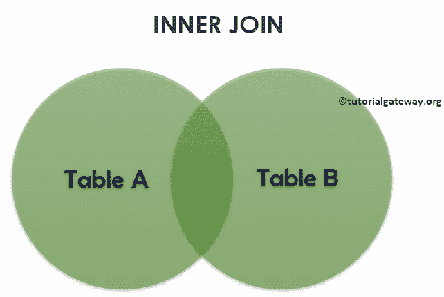
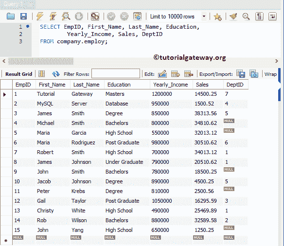
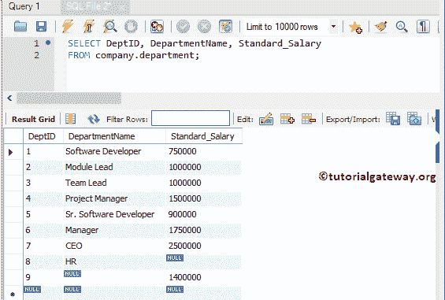
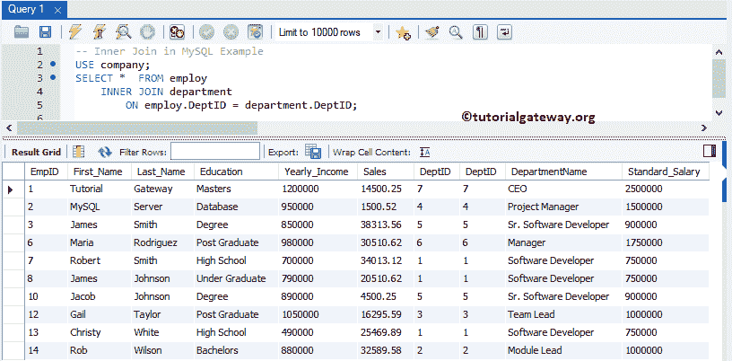
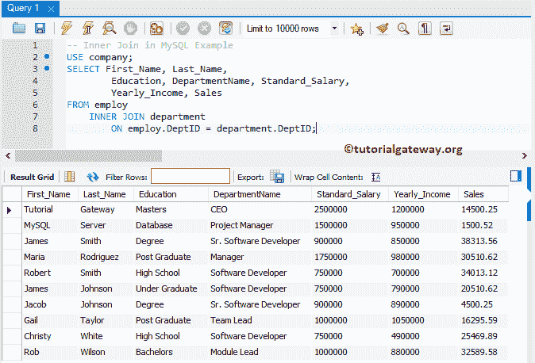
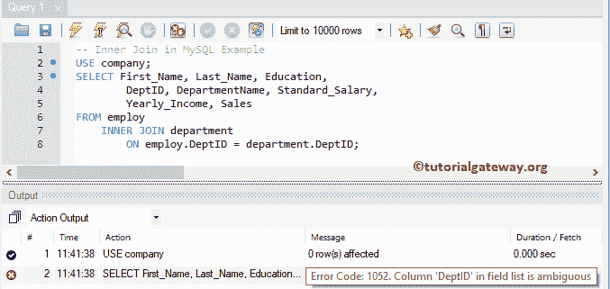
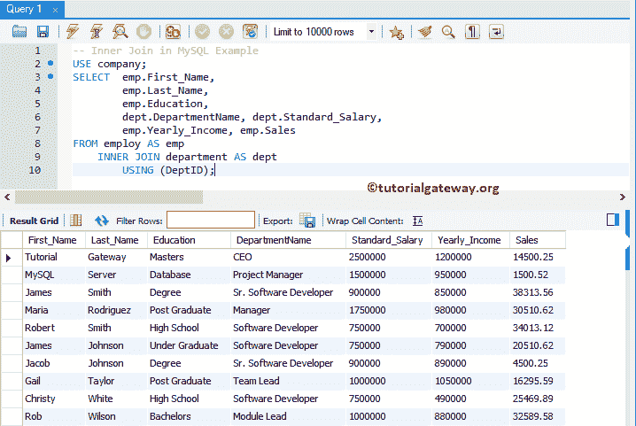
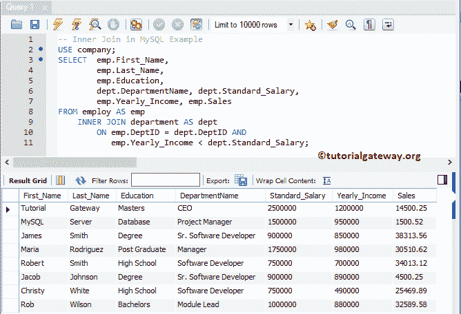
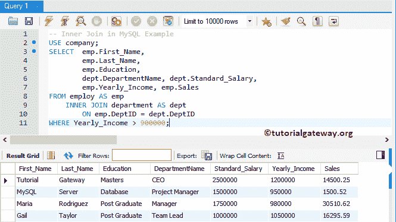
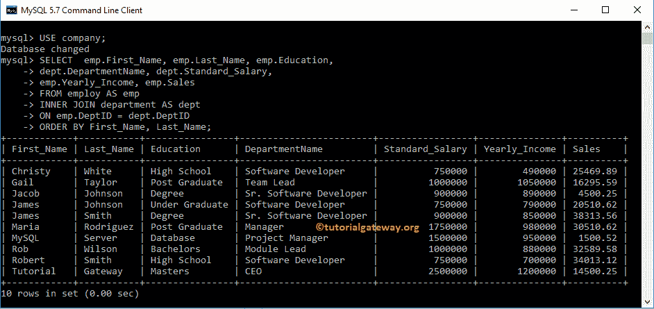

# MySQL 内连接

> 原文：<https://www.tutorialgateway.org/mysql-inner-join/>

如果列之间至少有一个匹配项，MySQL 内连接类型将返回两个表中的记录或行。或者，我们可以简单地说，只要 on 关键字后的条件为 TRUE，MySQL 内连接就会返回两个表中存在的行(或记录)。

MySQL 内部是默认的连接。所以你可以选择使用 INNER 关键字。为了更好地理解，让我们看看内连接的视觉表示。



从上面的截图中，您可以很容易地理解，MySQL 内连接只显示表 A 和表 B 中的匹配记录(就像数学中的交集)

## MySQL 内连接语法

MySQL 内连接的基本语法如下所示:

```sql
SELECT Table1.Column(s), Table2.Column(s)
FROM Table1
 INNER JOIN
     Table2 ON
   Table1.Common_Column = Table2.Common_Column

--OR We can Simply Write it as
SELECT Table1\. Column(s), Table2\. Column(s)
FROM Table1
 JOIN Table2 ON
    Table1.Common_Column = Table2.Common_Column
```

对于这个 MySQL 内连接示例，我们将使用公司数据库中的雇员表和部门表。现有数据为:



数据存在于部门



## MySQL 内连接示例

下面是使用它来组合两个表或从两个或多个表中获取信息(记录)的方法列表。

### MySQL 内连接选择*示例

以下查询显示了 employee 表和 Department 表中的所有列

```sql
USE company;
SELECT * FROM employ
   INNER JOIN department
      ON employ.DeptID = department.DeptID;
```

如果您观察下面的截图，虽然在 employ 表中有 15 条记录，但是 MySQL 内连接显示了 10 条记录。这是因为 [MySQL](https://www.tutorialgateway.org/mysql-tutorial/) 雇主表中剩余 5 条记录(即 EmpID 号 4、5、9、11 和 15)的 DeptID 值为 NULLS。



注:DeptID 列重复了两次，这可能会让最终用户感到厌烦。为了避免不需要的列，请选择各个列的名称。请避免在内连接中使用 SELECT *语句。

### MySQL 内连接选择很少的列

如前所述，请将所需的列放在 [`SELECT`语句](https://www.tutorialgateway.org/mysql-select-statement/)之后，以避免显示不需要的列。

```sql
USE company;
SELECT First_Name, Last_Name, Education, 
       DepartmentName, Standard_Salary,
       Yearly_Income, Sales
FROM employ
	INNER JOIN department
		ON employ.DeptID = department.DeptID;
```



#### MySQL 内连接中不明确的列

只要两个 employee 表和 Department 表中的列名不同，上述查询就可以完美运行。如果它们有相同的列名会发生什么？好吧，用上面指定的方法，你会陷入混乱。让我们看看如何解决这个问题。

让我给你看一个实际的例子。如您所见，我们使用的是相同的 MySQL 内连接查询。但是，我们从部门表中添加了 DepID 作为附加列。

```sql
USE company;
SELECT First_Name, Last_Name, Education, 
	DeptID, DepartmentName, Standard_Salary,
        Yearly_Income, Sales
FROM employ
	INNER JOIN department
		ON employ.DeptID = department.DeptID;
```

它引发了一个错误:不明确的列 DeptID。这是因为两个表中都有 DeptID 列，并且查询不知道您要求显示哪个列。



要解决此类问题，请始终在列名之前使用表名。

下面的查询是在列名之前使用[别名](https://www.tutorialgateway.org/mysql-alias/)表名。通过这种方法，我们可以通知服务器我们正在寻找属于部门表的 DepID。我们可以简单地将上面的查询写成:

```sql
USE company;
SELECT  emp.First_Name, 
	emp.Last_Name, 
        emp.Education, 
	dept.DeptID, dept.DepartmentName, dept.Standard_Salary,
        emp.Yearly_Income, emp.Sales
FROM employ AS emp
	INNER JOIN department AS dept
		ON emp.DeptID = dept.DeptID;
```


注意:在连接中，最好在列名之前使用表名(避免混淆)。例如，选择雇佣。名字

#### 使用关键字

如果两个表中公共列的名称相同，则使用 USING 关键字。以上查询也可以返回为:

```sql
USE company;
SELECT  emp.First_Name, 
	emp.Last_Name, 
        emp.Education, 
	dept.DepartmentName, dept.Standard_Salary,
        emp.Yearly_Income, emp.Sales
FROM employ AS emp
	INNER JOIN department AS dept
		USING (DeptID); -- Or use standard way
```



### MySQL 内连接多个条件

到目前为止，我们总是将`=`运算符作为加入雇主和部门表的条件。但是可以用< (less than), >(大于)替换=或者不等于运算符。

在本例中，我们使用两个条件来连接这些表。首先，工资应该匹配，年收入应该低于标准工资。

```sql
USE company;
SELECT  emp.First_Name, 
	emp.Last_Name, 
        emp.Education, 
	dept.DepartmentName, dept.Standard_Salary,
        emp.Yearly_Income, emp.Sales
FROM employ AS emp
   INNER JOIN department AS dept
	ON emp.DeptID = dept.DeptID AND
           emp.Yearly_Income < dept.Standard_Salary;
```



### MySQL 内连接`WHERE`子句示例

在这个 MySQL 例子中，我们展示了如何使用`WHERE`子句和内连接一起应用过滤器。建议大家参考 [MySQL `WHERE`子句](https://www.tutorialgateway.org/mysql-where-clause/)一文。

```sql
USE company;
SELECT  emp.First_Name, 
	emp.Last_Name, 
        emp.Education, 
	dept.DepartmentName, dept.Standard_Salary,
        emp.Yearly_Income, emp.Sales
FROM employ AS emp
	INNER JOIN department AS dept
		ON emp.DeptID = dept.DeptID
WHERE Yearly_Income > 900000;
```



## 命令提示符示例

让我告诉你，如何使用命令提示符编写查询。在这个例子中，我们展示了如何使用 `ORDER BY`子句对数据进行排序。建议大家参考 [MySQL Order By](https://www.tutorialgateway.org/mysql-order-by/) 文章。

```sql
USE company;
SELECT  emp.First_Name, 
	emp.Last_Name, 
        emp.Education, 
	dept.DepartmentName, dept.Standard_Salary,
        emp.Yearly_Income, emp.Sales
FROM employ AS emp
	INNER JOIN department AS dept
		ON emp.DeptID = dept.DeptID
ORDER BY First_Name, Last_Name;
```

