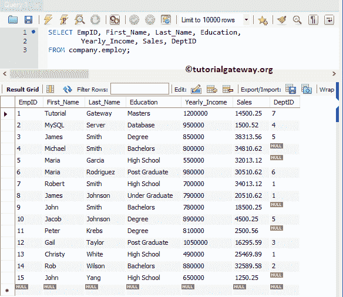
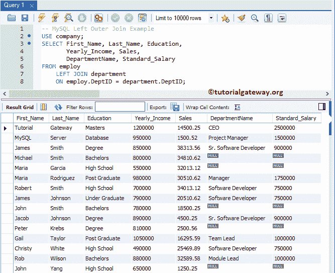

# MySQL 左连接

> 原文：<https://www.tutorialgateway.org/mysql-left-join/>

如何用命令提示符和工作台编写 MySQL 左连接示例？。MySQ Left 外部连接是返回第一个表中的所有记录(或行)，以及右表中匹配的行。

## MySQL 左连接语法

MySQL 左连接的基本语法如下所示:

```
SELECT Table1.Column(s), Table2.Column(s)
FROM Table1
 LEFT JOIN
     Table2 ON
   Table1.Common_Column = Table2.Common_Column

--OR We can Simply Write it as
SELECT Table1\. Column(s), Table2\. Column(s)
FROM Table1
 LEFT OUTER JOIN Table2 
      ON Table1.Common_Column = Table2.Common_Column
```

您可以选择使用外部关键字，因为两者是相同的。为了更好地理解，让我们看看 MySQL 左外连接的可视化表示。


从上图中，您可以很容易地理解，MySQL 左外连接显示了表 A 中存在的所有记录，以及表 B 中匹配的记录

注意: [MySQL](https://www.tutorialgateway.org/mysql-tutorial/) 右表中所有不匹配的行都将填入空值。

为了演示这一点，我们将使用公司数据库中的“雇用”和“部门”表。雇主提供的数据是:



本部门现有数据为:


## MySQL 左连接示例

以下是我们可以使用这种方法组合两个表或从两个或多个表中获取信息(记录)的方法列表。

### MySQL 左连接选择*示例

以下查询将显示“雇用”表中的所有列以及“部门”表中的匹配记录。

```
USE company;
SELECT *  FROM employ
    LEFT JOIN department
	ON employ.DeptID = department.DeptID;

```

如果您观察下面的截图，它显示了来自雇主的所有 15 条记录。但是对于[部门代码]、部门名称和标准薪资，它将显示空值的员工编号 4、5、9、11 和 15。

这是因为雇主中这些记录的部门代码为空。所以右表中没有匹配的记录。


注:DeptID 列重复了两次，这可能会让最终用户感到厌烦。为了避免不需要的列，我建议您选择单独的列名。请避免选择*语句。

### MySQL 左连接选择几列示例

如前所述，请在 [`SELECT`语句](https://www.tutorialgateway.org/mysql-select-statement/)后使用所需的列，以避免不需要的列

```
USE company;
SELECT First_Name, Last_Name, Education, 
       Yearly_Income, Sales,
       DepartmentName, Standard_Salary
FROM employ
    LEFT JOIN department
	ON employ.DeptID = department.DeptID;
```



#### MySQL 左连接示例中不明确的列

只要 employ 和 Department 中的列名与上面不同，上面指定的查询就可以完全工作。如果两个表中的列名相同，会发生什么情况？好吧，用上面指定的方法，你会陷入混乱。让我们看看如何解决这个问题。

让我给你看一个实际的例子。如您所见，我们使用的是相同的 MySQL 左连接查询。但是，我们添加了部门的 DepID 作为附加栏。

```
USE company;
SELECT  First_Name, Last_Name, Education, 
        Yearly_Income, Sales,
	DeptID, DepartmentName, Standard_Salary
FROM employ
	LEFT JOIN department
		ON employ.DeptID = department.DeptID;
```

如您所见，它抛出了一个错误:模棱两可的列 DeptID。这是因为，DeptID 列在两个表中都存在，而 MySQL 查询不知道您要求它显示哪一列。


要解决此类问题，请始终在列名之前使用表名。下面的查询是在列名之前使用[别名](https://www.tutorialgateway.org/mysql-alias/)表名。

通过这种方法，我们可以通知查询，我们正在寻找属于该部门的 DepID。我们可以简单地将上面的查询写成:

```
USE company;
SELECT  emp.First_Name,	emp.Last_Name, emp.Education,
	emp.Yearly_Income, emp.Sales,
        dept.DeptID, dept.DepartmentName, dept.Standard_Salary
FROM employ AS emp
	LEFT JOIN department AS dept
		ON emp.DeptID = dept.DeptID;
```


在 MySQL 左外连接中，在列名之前使用表名始终是一种最佳做法。例如，选择雇佣。名字

#### 使用关键字的 MySQL 左连接

如果两个表中的公共列名相同，则可以使用 USING 关键字。由于 DeptID 是这两个表中的公共列名，因此上面的查询也可以返回

```
USE company;
SELECT  emp.First_Name,	emp.Last_Name, emp.Education,
	emp.Yearly_Income, emp.Sales,
        dept.DeptID, dept.DepartmentName, dept.Standard_Salary
FROM employ AS emp
	LEFT JOIN department AS dept
		USING(DeptID);
```


### MySQL 左连接多个条件

到目前为止，我们向雇主和部门展示的条件是=操作员。但是可以用< (less than), >(大于)替换=或者不等于运算符。

为了连接这两个表，在这个例子中，我们使用了两个条件。以下查询将显示该部门的所有雇用记录和匹配记录。这里匹配记录的意思是，两个表的部门号应该匹配，标准薪资应该大于 1000000

```
USE company;
SELECT  empl.First_Name, empl.Last_Name, empl.Education, 
        empl.Yearly_Income, empl.Sales,
	dept.DepartmentName, dept.Standard_Salary
FROM employ AS empl
    LEFT JOIN department AS dept
	ON empl.DeptID = dept.DeptID AND
           dept.Standard_Salary > 1000000;
```


我想你对结果感到困惑。让我用小于代替大于符号。意思是两个表的 DeptID 要匹配，标准薪资要小于 1000000


### MySQL 左连接 Where 子句示例

在本例中，我们将向您展示如何同时使用 Where 子句(应用筛选器)。建议大家参考 [MySQL Where 子句](https://www.tutorialgateway.org/mysql-where-clause/)一文。

```
USE company;
SELECT  empl.First_Name, empl.Last_Name, empl.Education, 
        empl.Yearly_Income, empl.Sales,
	dept.DepartmentName, dept.Standard_Salary
FROM employ AS empl
    LEFT JOIN department AS dept
	ON empl.DeptID = dept.DeptID
WHERE Sales > 20000;
```


### 命令提示符示例

让我告诉你，如何在命令提示符下编写它。在这个例子中，我们还将展示如何同时使用 Order By 子句。建议大家参考 [MySQL Order By](https://www.tutorialgateway.org/mysql-order-by/) 文章。

```
USE company;
SELECT  empl.First_Name, empl.Last_Name, empl.Education, 
	depat.DepartmentName, depat.Standard_Salary,
        empl.Yearly_Income, empl.Sales
FROM employ AS empl
    LEFT JOIN department AS depat
 	ON empl.DeptID = depat.DeptID
ORDER BY First_Name, Last_Name;
```

