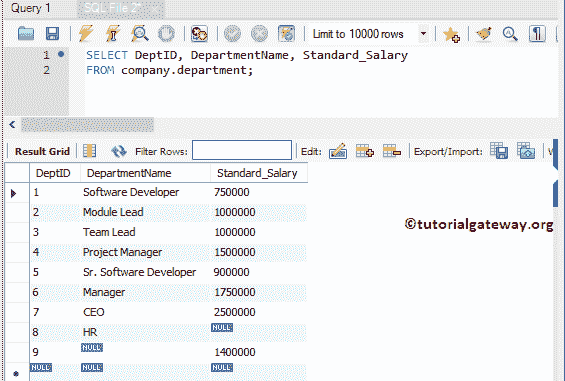
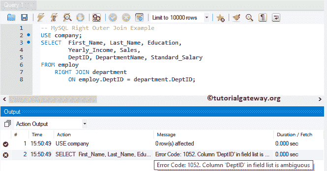

# MySQL 右加入

> 原文：<https://www.tutorialgateway.org/mysql-right-join/>

MySQL 右外连接是连接类型之一，它对于返回右表中的所有现有记录(或行)以及左表中的匹配行非常有用。左表中所有不匹配的行都用空值填充。

MySQL 右外连接也称为右连接。因此，您可以选择使用外部关键字

## MySQL 右连接语法

MySQL 右外连接的基本语法如下所示:

```
SELECT Table1.Column(s), Table2.Column(s)
FROM Table1
 RIGHT JOIN
     Table2 ON
   Table1.Common_Column = Table2.Common_Column

--OR We can Simply Write it as
SELECT Table1\. Column(s), Table2\. Column(s)
FROM Table1
 RIGHT OUTER JOIN Table2 
      ON Table1.Common_Column = Table2.Common_Column
```

为了更好地理解，让我们看看 MySQL 右外连接的可视化表示。


从上图中，您可以理解右外连接显示了表 B 中的所有记录，以及表 a 中的匹配行

为了演示 MySQL 的外连接，我们将使用公司数据库中的雇员和部门表。雇佣表中的数据为:


[MySQL](https://www.tutorialgateway.org/mysql-tutorial/) 部门表中的数据为:



## MySQL 右连接示例

以下是我们可以使用这个 MySQL 右外连接来组合两个表或从两个或多个表中获取信息(记录)的方法列表。

### 使用选择*的 MySQL 右连接

下面的右外连接查询显示部门表中的所有列，以及来自雇用表的匹配记录

```
USE company;
SELECT *  FROM employ
    RIGHT OUTER JOIN department
	ON employ.DeptID = department.DeptID;

```

如果您观察下面的截图，MySQL 右侧的外连接显示了部门表和雇佣表中的 12 条记录。但是对于 employ 表中的最后两行，返回空值。这是因为“雇用”表中这些记录的部门代码为空。


注:DeptID 列重复了两次，这可能会让最终用户感到厌烦。为了避免不需要的列，我建议您选择单独的列名。请避免右外连接中的 SELECT *语句。

### MySQL 右连接选择几列

如前所述，请在 [`SELECT`语句](https://www.tutorialgateway.org/mysql-select-statement/)后使用所需的列，以避免不需要的列

```
USE company;
SELECT First_Name, Last_Name, Education, 
       Yearly_Income, Sales,
       DepartmentName, Standard_Salary
FROM employ
    RIGHT JOIN department
	ON employ.DeptID = department.DeptID;
```


#### MySQL 右连接处理不明确的列

只要来自 employ 和 Department 的列名与上面不同，上面的右连接查询就可以完美地工作。如果两个表中的列名相同，会发生什么情况？用上面指定的方法，你会陷入混乱。让我们看看如何解决这个问题。

让我给你看一个右连接模糊列的实际例子。如您所见，我们使用相同的右连接查询。但是，我们从部门表中添加了 DepID 作为附加列。

```
USE company;
SELECT  First_Name, Last_Name, Education, 
        Yearly_Income, Sales,
	DeptID, DepartmentName, Standard_Salary
FROM employ
    RIGHT JOIN department
	ON employ.DeptID = department.DeptID;
```

如您所见，它抛出了一个错误:模棱两可的列 DeptID。这是因为，DeptID 列在两个表中都存在，而 MySQL 查询不知道您要求它显示哪一列。



要解决 MySQL 右外连接中的这些问题，您必须始终在列名之前使用表名。下面的查询是在列名之前使用[别名](https://www.tutorialgateway.org/mysql-alias/)表名。通过这种方法，我们可以通知正确的连接查询，我们正在寻找属于部门表的 DepID。

我们可以简单地将上面的查询写成:

```
USE company;
SELECT  emp.First_Name,	emp.Last_Name, emp.Education,
		emp.Yearly_Income, emp.Sales,
        dept.DeptID, dept.DepartmentName, dept.Standard_Salary
FROM employ AS emp
	RIGHT OUTER JOIN department AS dept
		ON emp.DeptID = dept.DeptID;
```


注意:在右外连接中，在列名之前使用表名始终是最佳做法。例如，选择雇佣。名字

#### 使用关键字的 MySQL 右连接

如果两个表中的公共列名相同，则可以使用 USING 关键字。这里 DeptID 是两个表中的公共列名，因此上面的查询也可以返回如下:

```
USE company;
SELECT  emp.First_Name,	emp.Last_Name, emp.Education,
		emp.Yearly_Income, emp.Sales,
        dept.DepartmentName, dept.Standard_Salary
FROM employ AS emp
	RIGHT OUTER JOIN department AS dept
		USING(DeptID);
```


### 使用多个条件的 MySQL 右连接

到目前为止，我们将`=`运算符显示为正确连接雇佣表和部门表的条件。但是可以用< (less than), >(大于)替换=或者不等于运算符。在本例中，我们使用两个条件来右连接这两个表。

下面的右连接查询显示了 employ 表中的所有记录，以及 department 表中的匹配记录。这里匹配记录的意思是，两个表的 DeptID 要匹配，年收入要大于 80 万

```
USE company;
SELECT  empl.First_Name, empl.Last_Name, empl.Education, 
        empl.Yearly_Income, empl.Sales,
	dept.DepartmentName, dept.Standard_Salary
FROM employ AS empl
    RIGHT JOIN department AS dept
	ON empl.DeptID = dept.DeptID AND
           empl.Yearly_Income > 800000;
```


我想你对结果感到困惑。让我用小于代替大于符号。这意味着，两个表的 DeptID 应该匹配，年收入应该小于 1000000


### MySQL 右连接`WHERE`子句示例

在这个例子中，我们展示了如何使用`WHERE`子句(应用过滤器)和右外连接。建议大家参考 [MySQL `WHERE`子句](https://www.tutorialgateway.org/mysql-where-clause/)一文。

```
USE company;
SELECT  empl.First_Name, empl.Last_Name, empl.Education, 
        empl.Yearly_Income, empl.Sales,
	dept.DepartmentName, dept.Standard_Salary
FROM employ AS empl
    RIGHT JOIN department AS dept
	ON empl.DeptID = dept.DeptID
WHERE Standard_Salary > 750000;
```


## MySQL 右连接示例命令提示符

让我演示如何使用命令提示符编写 MySQL 右外连接查询。在这个例子中，我们还展示了如何使用 `ORDER BY`子句和右外连接。建议大家参考 [MySQL Order By](https://www.tutorialgateway.org/mysql-order-by/) 文章。

```
USE company;
SELECT  empl.First_Name, empl.Last_Name, empl.Education, 
        empl.Yearly_Income, empl.Sales,
	dept.DepartmentName, dept.Standard_Salary
FROM employ AS empl
    RIGHT JOIN department AS dept
	ON empl.DeptID = dept.DeptID
ORDER BY First_Name, Last_Name;
```

