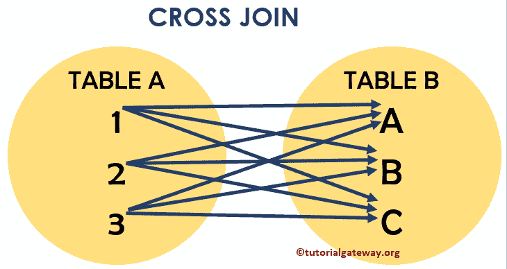
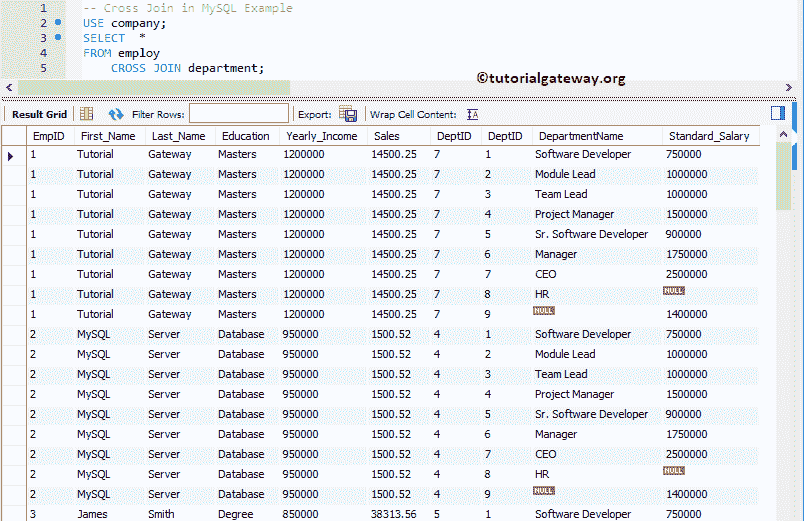
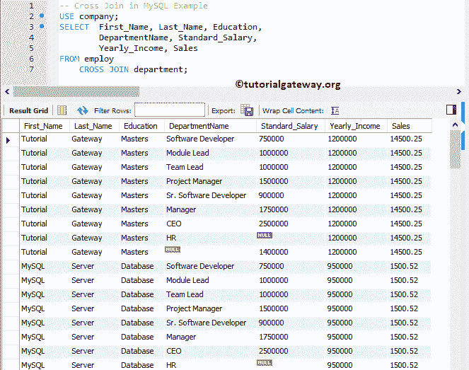
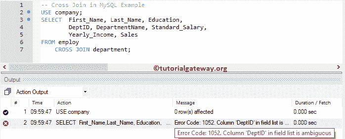
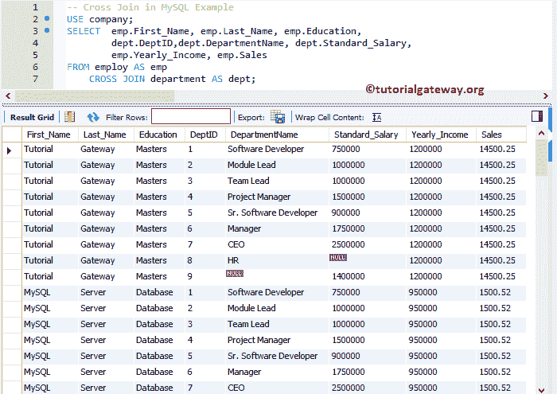
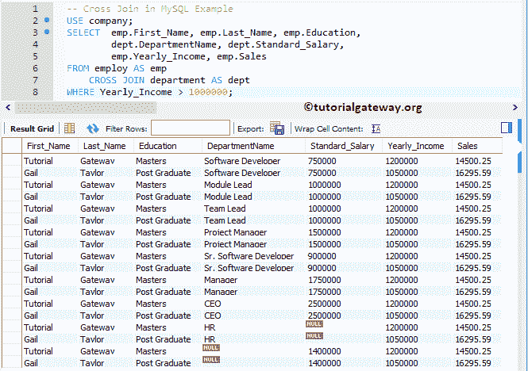
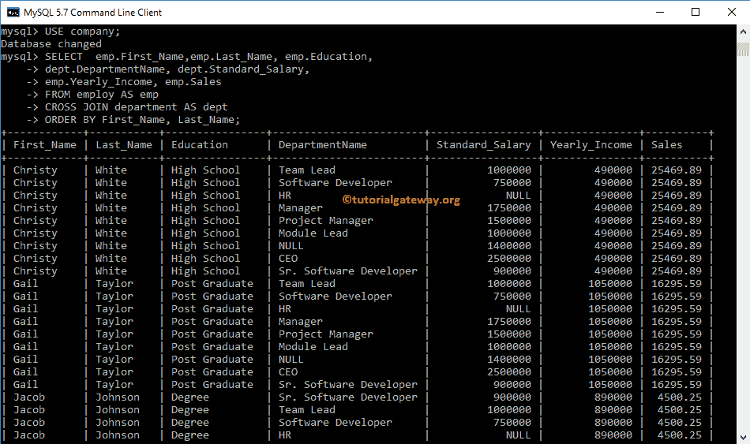

# MySQL 交叉连接

> 原文:[https://www.tutorialgateway.org/mysql-cross-join/](https://www.tutorialgateway.org/mysql-cross-join/)

MySQL 交叉连接返回两个表的笛卡尔乘积。MySQL 中的交叉连接不需要任何公共列来连接两个表。笛卡尔乘积表示表 1 中的行数乘以表 2 中的行数。

## SQL 交叉连接语法

MySQL 中交叉连接的基本语法是

```
SELECT Table1.Column(s), Table2.Column(s),
FROM Table1
 CROSS JOIN
     Table2 

--OR We can Simply Write it as
SELECT Table1\. Column(s), Table2\. Column(s),
FROM Table1, Table2
```

为了更好地理解，让我们看看 MySQL 交叉连接的可视化表示。



从上面的截图中，您可以很容易地理解 MySQL 交叉连接显示了两个表的笛卡尔乘积。这意味着，表 A 中的每条记录都与表 B 中的每条记录相结合

对于这个 MySQL 交叉连接的例子，我们将使用公司数据库中的雇佣表和部门表。现有数据为:


数据呈现在 [MySQL](https://www.tutorialgateway.org/mysql-tutorial/) 部门是:

T4】

## MySQL 交叉连接示例

以下是我们可以用来组合两个或从两个或多个表中获取信息(记录)的方法列表。

### 使用选择*的 MySQL 交叉连接

以下查询显示了雇用表和部门表中的所有列

```
USE company;
SELECT * FROM employ
   CROSS JOIN department;
```

如果你观察下面的截图，它显示了 135 条记录。意思是雇主的 15 行乘以部门表



中的 9 行

注:DeptID 列重复了两次，这可能会让最终用户感到厌烦。为了避免不需要的列，我建议您选择单独的列名。请避免其中的 SELECT *语句。

### 选择几列

如前所述，请将所需的列放在 [SELECT 语句](https://www.tutorialgateway.org/mysql-select-statement/)之后，以避免不需要的列

```
USE company;
SELECT First_Name, Last_Name, Education, 
       DepartmentName, Standard_Salary,
       Yearly_Income, Sales
FROM employ
	CROSS JOIN department;
```



#### MySQL 交叉连接中不明确的列

只要两个表(employ 和 Department)中的列名不同，上述查询就可以完美地工作。如果两个表中的列名相同，会发生什么情况？用上面指定的方法，你会陷入混乱。让我们看看如何解决这个问题。

给大家看一个 MySQL 交叉 Join 歧义列的实际例子。如您所见，我们使用相同的查询。但是，我们从部门表中添加了 DepID 作为附加列。

```
USE company;
SELECT First_Name, Last_Name, Education, 
	DeptID, DepartmentName, Standard_Salary,
        Yearly_Income, Sales
FROM employ
	CROSS JOIN department;
```

从下面的截图可以看出，它抛出了一个错误:模棱两可的列 DeptID。这是因为两个表中都有 DeptID 列，而 MySQL 查询不知道您要求它显示哪一列。



要解决这种问题，您必须经常在列名之前使用表名。下面的查询是在列名之前使用[别名](https://www.tutorialgateway.org/mysql-alias/)表名。通过这种方法，我们可以通知查询，我们正在寻找属于部门表的 DepID。

我们可以简单地将上面的查询写成:

```
USE company;
SELECT  emp.First_Name,	emp.Last_Name, emp.Education, 
	    dept.DeptID,dept.DepartmentName, dept.Standard_Salary,
        emp.Yearly_Income, emp.Sales
FROM employ AS emp
	CROSS JOIN department AS dept;
```



注意:最好的做法是在列名之前使用表名。例如，选择雇佣。名字

### MySQL 交叉连接 Where 子句示例

在这个例子中，我们向您展示了如何同时使用 Where 子句(应用过滤器)。建议大家参考 [MySQL Where 子句](https://www.tutorialgateway.org/mysql-where-clause/)一文。

```
USE company;
SELECT  emp.First_Name,	emp.Last_Name, emp.Education, 
	dept.DepartmentName, dept.Standard_Salary,
        emp.Yearly_Income, emp.Sales
FROM employ AS emp
	CROSS JOIN department AS dept
WHERE Yearly_Income > 1000000;
```



### 命令提示符示例

让我向您展示如何使用命令提示符编写这个查询。在这个例子中，我们展示了如何使用 Order By 子句。建议大家参考 [MySQL Order By](https://www.tutorialgateway.org/mysql-order-by/) 文章。

```
USE company;
SELECT  emp.First_Name, 
	emp.Last_Name, 
        emp.Education, 
	dept.DepartmentName, dept.Standard_Salary,
        emp.Yearly_Income, emp.Sales
FROM employ AS emp
	CROSS JOIN department AS dept
ORDER BY First_Name, Last_Name;
```

