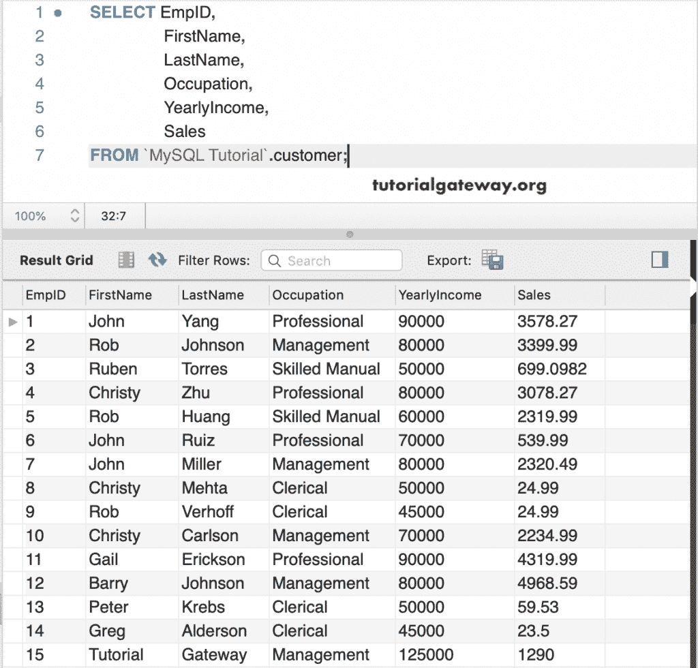
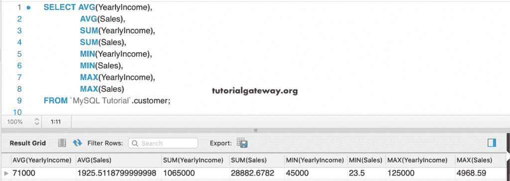
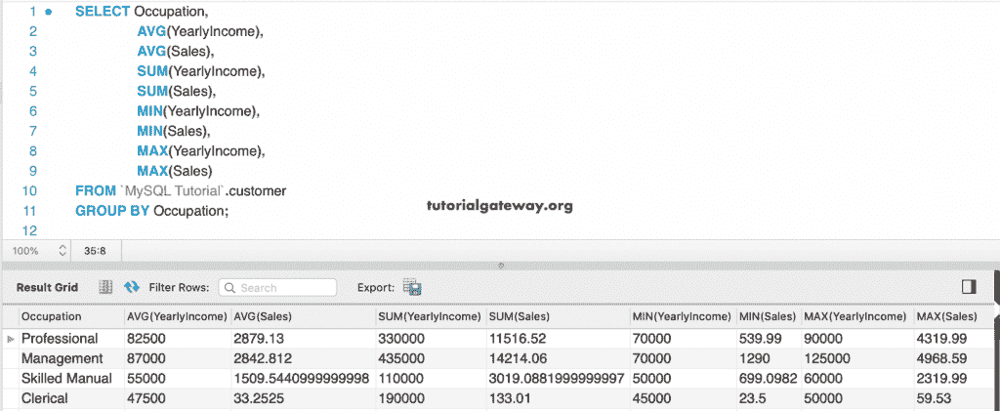
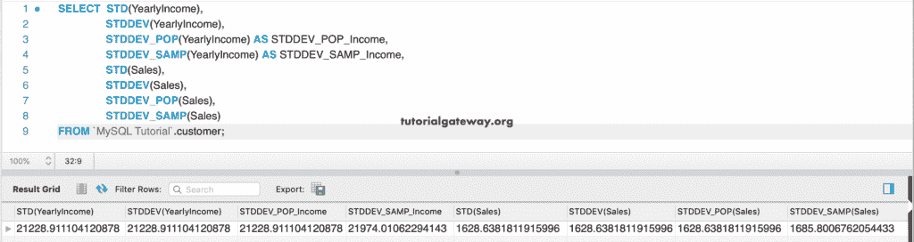
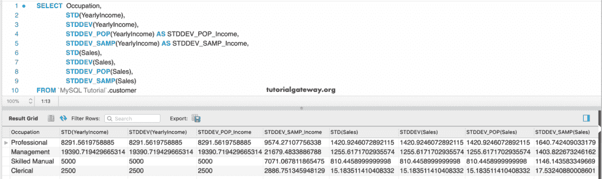
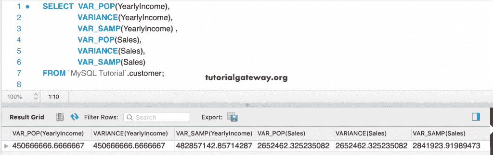
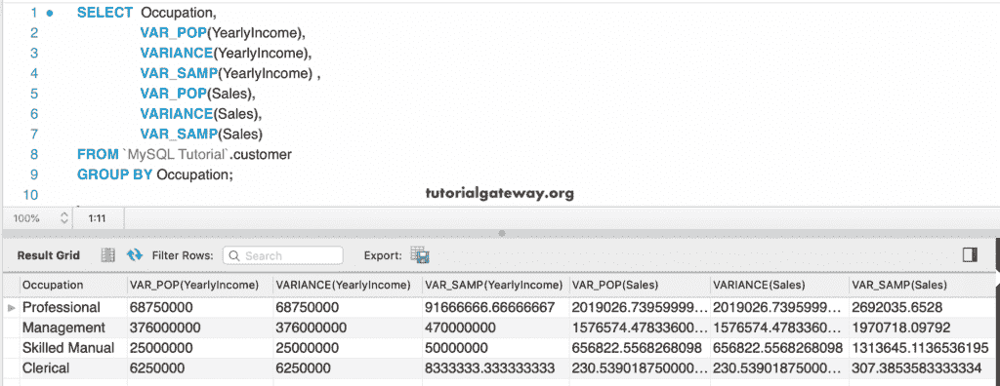
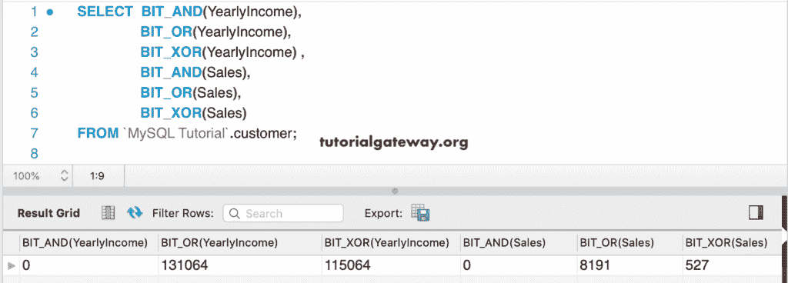
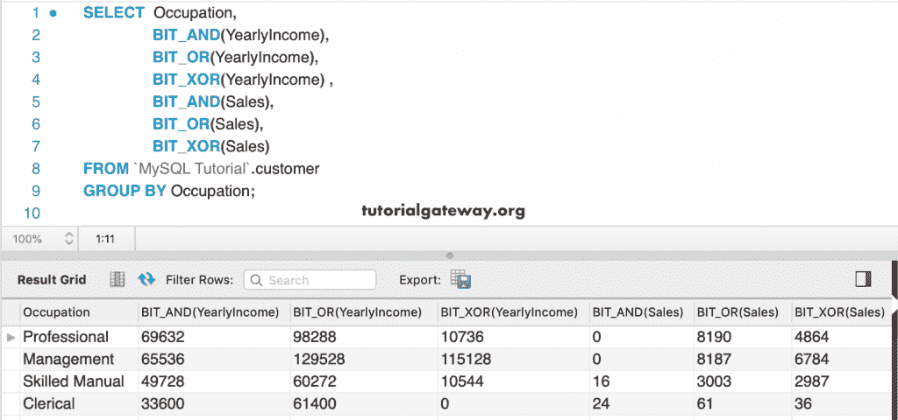
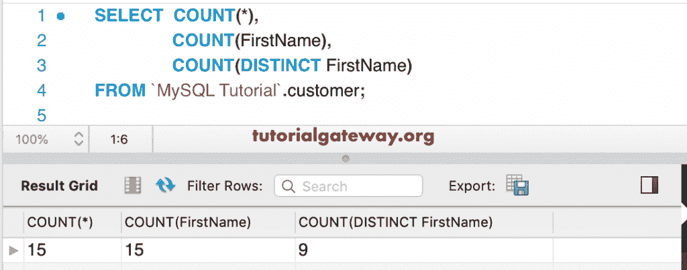

# MySQL 聚合函数

> 原文：<https://www.tutorialgateway.org/mysql-aggregate-functions/>

MySQL 提供了各种聚合函数来执行或计算聚合值，比如求最小值、最大值、和等。通常，我们使用 MySQL 聚合函数和 `GROUP BY`子句来查找每个组的聚合值。但是，您可以在没有 `GROUP BY`子句的情况下使用它们。

## MySQL 聚合函数

以下是可供使用的 MySQL 聚合函数列表。

| 方法 | 描述 |
| [AVG()](https://www.tutorialgateway.org/mysql-avg-function/) | 它查找或返回平均值。 |
| [BIT_AND()](https://www.tutorialgateway.org/mysql-bit_and-function/) | 返回按位“与” |
| [BIT_OR()](https://www.tutorialgateway.org/mysql-bit_or-function/) | 它返回按位“或”值。 |
| [BIT_XOR()](https://www.tutorialgateway.org/mysql-bit_xor-function/) | 返回按位异或值 |
| COUNT() | 计算返回的行数。 |
| 计数(独特) | 它计算不同值的数量。 |
| GROUP_CONCAT() | 返回串联字符串 |
| [MAX()](https://www.tutorialgateway.org/mysql-max-function/) | 查找最大值 |
| [MIN()](https://www.tutorialgateway.org/mysql-min-function/) | 使用这个 MySQL 聚合函数来找到最小值。 |
| [STD()](https://www.tutorialgateway.org/mysql-stddev_pop-function/) | 总体标准偏差 |
| [STDDEV()](https://www.tutorialgateway.org/mysql-stddev_pop-function/) | 用这个 [MySQL](https://www.tutorialgateway.org/mysql-tutorial/) 方法得到总体标准差 |
| [STDDEV_POP()](https://www.tutorialgateway.org/mysql-stddev_pop-function/) | 这将返回总体标准偏差 |
| [STDDEV_SAMP()](https://www.tutorialgateway.org/mysql-stddev_samp-function/) | 返回样本标准偏差 |
| [SUM()](https://www.tutorialgateway.org/mysql-sum-function/) | 使用这个 MySQL 聚合函数返回或找到总和。 |
| [VAR_POP()](https://www.tutorialgateway.org/mysql-var_pop-function/) | 此方法返回总体标准方差。 |
| [VAR_SAMP()](https://www.tutorialgateway.org/mysql-var_samp-function/) | 它返回样本方差。 |
| [方差()](https://www.tutorialgateway.org/mysql-var_pop-function/) | 此方法返回总体标准方差。 |

### MySQL 聚合函数示例 1

为了演示这些 MySQL 聚合函数，我们将使用下面显示的数据



在本例中，我们将对年收入和销售额列使用 AVG、求和、最小和最大方法。以下聚合查询计算客户表中的“年收入总和”、“平均值”、“最小值”和“最大值”列以及“销售额”列。

```sql
SELECT   AVG(YearlyIncome),
         AVG(Sales),
         SUM(YearlyIncome),
         SUM(Sales),
         MIN(YearlyIncome),
         MIN(Sales),
         MAX(YearlyIncome),
         MAX(Sales)
 FROM customer;
```



通常，我们使用这些 mysql 聚合函数和 `GROUP BY`子句来按类别对项目进行分组。让我们看看这个例子。

```sql
SELECT Occupation, 
       AVG(YearlyIncome),
       AVG(Sales),
       SUM(YearlyIncome),
       SUM(Sales),
       MIN(YearlyIncome),
       MIN(Sales),
       MAX(YearlyIncome),
       MAX(Sales)
 FROM customer
 GROUP BY Occupation;
```



### MySQL 聚合函数示例 2

在本例中，我们将使用 MySQL 的“年收入和销售额”列、STDDEV 列、STDDEV_POP 列和 STDDEV_SAMP 列来查找这两个列的标准差。

```sql
SELECT  STD(YearlyIncome),
        STDDEV(YearlyIncome),
        STDDEV_POP(YearlyIncome) AS STDDEV_POP_Income,
        STDDEV_SAMP(YearlyIncome) AS STDDEV_SAMP_Income,
        STD(Sales),
        STDDEV(Sales),
        STDDEV_POP(Sales),
        STDDEV_SAMP(Sales)
 FROM customer;
```



此示例与上面的示例相同，但是这一次，我们使用了“职业”列来对客户进行分组。接下来，我们使用上面提到的方法来寻找标准差。

```sql
SELECT  Occupation,
        STD(YearlyIncome),
        STDDEV(YearlyIncome),
        STDDEV_POP(YearlyIncome) AS STDDEV_POP_Income,
        STDDEV_SAMP(YearlyIncome) AS STDDEV_SAMP_Income,
        STD(Sales),
        STDDEV(Sales),
        STDDEV_POP(Sales),
        STDDEV_SAMP(Sales)
 FROM customer
 GROUP BY Occupation;
```



### 聚合函数示例 3

在本例中，我们将使用 MySQL 聚合函数，如方差、VAR_POP 和 VAR_SAMP 对年收入和销售额列的影响。他们找到了这两列的标准方差。

```sql
SELECT  VAR_POP(YearlyIncome),
        VARIANCE(YearlyIncome),
        VAR_SAMP(YearlyIncome) ,
        VAR_POP(Sales),
        VARIANCE(Sales),
        VAR_SAMP(Sales)
 FROM customer;
```



使用“职业”列对客户进行分组。接下来，我们使用前面提到的方差函数来寻找每个组的标准方差。

```sql
SELECT  Occupation,
        VAR_POP(YearlyIncome),
        VARIANCE(YearlyIncome),
        VAR_SAMP(YearlyIncome) ,
        VAR_POP(Sales),
        VARIANCE(Sales),
        VAR_SAMP(Sales)
 FROM customer
 GROUP BY Occupation;
```



### MySQL 聚合函数示例 4

我们在年收入和销售额栏中使用 MySQL 的位与、位或和位异或。

```sql
SELECT  BIT_AND(YearlyIncome),
        BIT_OR(YearlyIncome),
        BIT_XOR(YearlyIncome) ,
        BIT_AND(Sales),
        BIT_OR(Sales),
        BIT_XOR(Sales)
 FROM customer;
```



这里，我们使用 `GROUP BY`子句对客户表中的“职业”列进行分组。接下来，我们使用上面提到的聚合函数。

```sql
SELECT  Occupation,
        BIT_AND(YearlyIncome),
        BIT_OR(YearlyIncome),
        BIT_XOR(YearlyIncome) ,
        BIT_AND(Sales),
        BIT_OR(Sales),
        BIT_XOR(Sales)
 FROM customer
 GROUP BY Occupation;
```



这个例子向你展示了 MySQL 的 COUNT 和 COUNT(DISTINCT)函数的例子。这里，我们在名字列中使用了这两种方法。如您所见，COUNT(DISTINCT)函数正在返回此列中不同或唯一记录的计数。

```sql
SELECT  COUNT(*),
        COUNT(FirstName),
        COUNT(DISTINCT FirstName)
 FROM customer
```

