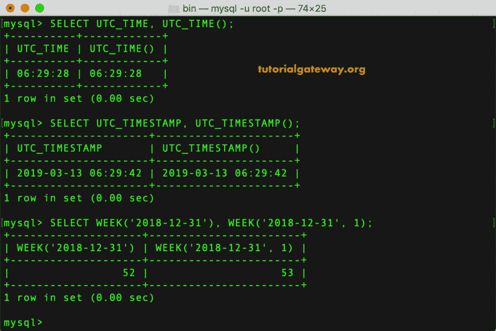

# MySQL 日期函数

> 原文：<https://www.tutorialgateway.org/mysql-date-functions/>

MySQL 提供了各种日期和时间函数来处理日期，例如查找当前日期、时间、格式化日期、提取日期部分、时间部分等。

## MySQL 日期函数

以下是可用于日期和时间的 MySQL 日期函数列表。您可以单击每个 MySQL 日期和时间函数，查看该函数的详细信息，并提供多个示例。或者，向下滚动查看每个日期和时间功能的示例。

| MySQL 日期函数 | 描述 |
| add date() | 将间隔中的日期值添加到给定日期。 |
| [添加时间（）](https://www.tutorialgateway.org/mysql-addtime-function/) | 这增加了时间 |
| [CONVERT_TZ()](https://www.tutorialgateway.org/mysql-convert_tz-function/) | 这个 MySQL 日期函数将日期和时间从一个时区转换到另一个时区。 |
| 库尔德语() | 返回当前日期 |
| [当前 _ 日期](https://www.tutorialgateway.org/mysql-current-date/)，[当前 _ 日期()](https://www.tutorialgateway.org/mysql-current-date/) | CODETATE()的同义词 |
| [当前时间()](https://www.tutorialgateway.org/mysql-current-time/)[当前时间](https://www.tutorialgateway.org/mysql-current-time/) | CURTIME()函数的同义词 |
| [CURRENT_TIMESTAMP()](https://www.tutorialgateway.org/mysql-current_timestamp/) ， [CURRENT_TIMESTAMP](https://www.tutorialgateway.org/mysql-current_timestamp/) | NOW()函数的同义词 |
| [CURTIME()](https://www.tutorialgateway.org/mysql-curtime-function/) | 这个 [MySQL](https://www.tutorialgateway.org/mysql-tutorial/) 函数返回当前时间 |
| [DATE()](https://www.tutorialgateway.org/mysql-date-function/) | 它从给定日期或日期时间表达式中提取日期部分 |
| [DATE_ADD()](https://www.tutorialgateway.org/mysql-date_add-function/) | 它向日期表达式添加给定的时间间隔 |
| [DATE_FORMAT()](https://www.tutorialgateway.org/mysql-date_format/) | 该功能根据我们的要求格式化日期。 |
| [DATE_SUB()](https://www.tutorialgateway.org/mysql-date_sub-function/) | 这将从给定日期中减去指定的时间间隔。 |
| [DATEDIFF()](https://www.tutorialgateway.org/mysql-datediff-function/) | 从一个日期减去另一个日期，并返回差值。 |
| [DAY()](https://www.tutorialgateway.org/mysql-day-function/) | DAYOFMONTH()函数的同义词。 |
| [中的 NAME()](https://www.tutorialgateway.org/mysql-dayname-function/) | 这个 MySQL 日期函数返回工作日的名称。例如星期一 |
| [月日（）](https://www.tutorialgateway.org/mysql-dayofmonth/) | 它返回从 1 到 31 的月中的天数 |
| [星期（）](https://www.tutorialgateway.org/mysql-dayofweek/) | 这会返回用户给定日期的 Weekday 索引。 |
| [日年（）](https://www.tutorialgateway.org/mysql-dayofyear-function/) | 返回一年中的某一天或某一天的数字，即 1 到 366 |
| [EXTRATE()](https://www.tutorialgateway.org/mysql-extract-function/) | 用它来提取日期的一部分。 |
| [FROM_DAYS()](https://www.tutorialgateway.org/mysql-from_days-function/) | 这个 MySQL 日期函数将给定的日期转换成日期。 |
| [FROM_UNIXTIME()](https://www.tutorialgateway.org/mysql-from_unixtime/) | 用于格式化 Unix 时间-篡改为日期 |
| [GET_FORMAT()](https://www.tutorialgateway.org/mysql-get_format-function/) | 这将返回日期格式字符串。 |
| [HOUR()](https://www.tutorialgateway.org/mysql-hour-function/) | 返回给定时间的小时值。 |
| [LAST_DAY](https://www.tutorialgateway.org/mysql-last_day-function/) | 它返回给定日期的每月最后一天。 |
| [局部时间()](https://www.tutorialgateway.org/mysql-localtime-function/)、[局部时间](https://www.tutorialgateway.org/mysql-localtime-function/) | NOW()函数的同义词 |
| [局部时间戳()](https://www.tutorialgateway.org/mysql-localtimestamp/)、[局部时间戳](https://www.tutorialgateway.org/mysql-localtimestamp/) | NOW()函数的同义词 |
| [日期（）](https://www.tutorialgateway.org/mysql-makedate-function/) | 它用于从指定的年份和一年中的某一天创建或创建日期 |
| [MAKETIME()](https://www.tutorialgateway.org/mysql-maketime-function/) | 这将创建或使时间从小时，分钟，秒 |
| [微秒()](https://www.tutorialgateway.org/mysql-microsecond-function/) | 返回给定时间或日期时间的微秒数。 |
| [MINUTE()](https://www.tutorialgateway.org/mysql-minute-function/) | 此函数返回给定时间或日期时间的分钟值。 |
| [MONTH()](https://www.tutorialgateway.org/mysql-month-function/) | 它返回月号(1-12) |
| [月份名称 （）](https://www.tutorialgateway.org/mysql-monthname-function/) | 返回月份名称或月份名称(一月、二月等)。) |
| [NOW()](https://www.tutorialgateway.org/mysql-now-function/) | 这个函数返回当前的日期和时间。 |
| [PERIOD_ADD()](https://www.tutorialgateway.org/mysql-period_add-function/) | 它将用户指定的期间添加到年-月中 |
| [PERIOD_DIFF()](https://www.tutorialgateway.org/mysql-period_diff-function/) | 返回两个周期之间的差值。它返回这两个期间之间的月数。 |
| [QUARTER()](https://www.tutorialgateway.org/mysql-quarter-function/) | 它会查找并返回该日期属于哪个季度 |
| [SEC_TO_TIME()](https://www.tutorialgateway.org/mysql-sec_to_time-function/) | 将给定的秒转换为时:分:秒格式。 |
| [SECOND()](https://www.tutorialgateway.org/mysql-second-function/) | 返回给定时间的秒值(0-59)。 |
| [STR_TO_DATE()](https://www.tutorialgateway.org/mysql-str_to_date-function/) | 该函数将字符串转换为日期。 |
| [SUBDATE()](https://www.tutorialgateway.org/mysql-subdate-function/) | DATE_SUB()函数的同义词 |
| [枯草杆菌蛋白酶()](https://www.tutorialgateway.org/mysql-subtime-function/) | 从时间中减去时间间隔。 |
| [SYSDATE()](https://www.tutorialgateway.org/mysql-sysdate-function/) | 返回函数执行的当前系统日期和时间 |
| [时间()](https://www.tutorialgateway.org/mysql-time-function/) | 这个 MySQL 日期函数从给定的日期时间或表达式中提取时间部分 |
| [TIME_FORMAT()](https://www.tutorialgateway.org/mysql-time_format-function/) | 使用它将给定的表达式格式化为时间。 |
| [时间 _ 至 _ 秒()](https://www.tutorialgateway.org/mysql-time_to_sec-function/) | 此方法将给定时间转换为秒。 |
| [TIMEDIFF()](https://www.tutorialgateway.org/mysql-timediff-function/) | 它减去了时间。 |
| [时间戳()](https://www.tutorialgateway.org/mysql-timestamp-function/) | 它返回日期或日期时间表达式。 |
| [时间戳记 ADD()](https://www.tutorialgateway.org/mysql-timestampadd-function/) | 这将为日期时间表达式添加一个间隔 |
| [TIMESTAMPDIFF()](https://www.tutorialgateway.org/mysql-timestampdiff-function/) | 此函数从给定的日期时间表达式中减去一个间隔。 |
| [TO_DAYS()](https://www.tutorialgateway.org/mysql-to_days-function/) | 将给定日期转换为总天数。 |
| [TO_SECONDS()](https://www.tutorialgateway.org/mysql-to_seconds-function/) | 将给定的日期或日期时间表达式转换为自第 0 年起的秒。 |
| [UNIX _ 时间戳](https://www.tutorialgateway.org/mysql-unix_timestamp-function/) | 用于返回 Unix 时间戳 |
| [UTC_Date](https://www.tutorialgateway.org/mysql-utc_date-function/) | 它返回当前世界协调时日期 |
| [世界协调时 _ 时间](https://www.tutorialgateway.org/mysql-utc_time-function/) | 此方法返回当前世界协调时时间 |
| [UTC_TimeStamp](https://www.tutorialgateway.org/mysql-utc_timestamp/) | 返回当前世界协调时日期和时间。 |
| [周](https://www.tutorialgateway.org/mysql-week-function/) | 此方法返回周数 |
| [工作日](https://www.tutorialgateway.org/mysql-weekday-function/) | 返回工作日索引 |
| [一年中的第几周](https://www.tutorialgateway.org/mysql-weekofyear/) | 这个函数返回日期的日历周。范围从 1 到 53 |
| [年](https://www.tutorialgateway.org/mysql-year-function/) | 这将返回年值。 |
| 年周 | 返回年和周 |

## MySQL 中日期和时间函数的时间间隔

以下是可用的时间间隔表达式和单位值列表。

| 单位价值 | 预期的表达式格式 |
| 微秒 | 微秒 |
| 第二 | 秒 |
| 分钟 | 分钟 |
| 小时 | 小时 |
| 天 | 天 |
| 周 | 周末 |
| 月 | 月份 |
| 四分之一 | 四分之一 |
| 年 | 年 |
| 秒 _ 微秒 | 秒。'微秒' |
| MINUTE _ 微秒 | 分钟:秒。'微秒' |
| 分钟 _ 秒 | '分钟:秒' |
| 小时 _ 微秒 | 小时:分钟:秒。'微秒' |
| 小时 _ 秒 | “小时:分钟:秒” |
| 小时 _ 分钟 | 小时:分钟 |
| DAY _ 微秒 | 天数小时:分钟:秒。'微秒' |
| 第二天 | '天小时:分钟:秒' |
| 日 _ 分钟 | '天小时:分钟' |
| 日 _ 小时 | 天数小时数 |
| 年 _ 月 | 年-月 |

## MySQL 日期和时间函数示例

以下示例帮助您理解 MySQL 中的这些日期和时间函数

### MySQL 日期函数示例 1

在本例中，我们将使用[添加日期](https://www.tutorialgateway.org/mysql-adddate-function/)和[添加时间](https://www.tutorialgateway.org/mysql-addtime-function/)来添加给定值。接下来，我们使用 [CONVERT_TZ](https://www.tutorialgateway.org/mysql-convert_tz-function/) 将日期从一个标准转换为另一个标准。

```sql
SELECT ADDDATE('2016-01-02', INTERVAL 2 MONTH), ADDDATE('2018-02-01', INTERVAL 31 DAY);

SELECT ADDTIME('2018-12-31 23:55:57', '2 2:22:22');

SELECT CONVERT_TZ('2018-12-31 23:59:59', '+00:00', '-05:30');
```


### MySQL 日期函数示例 2

在本例中，我们将使用[curate()](https://www.tutorialgateway.org/mysql-curdate-function/)、 [CURRENT_DATE](https://www.tutorialgateway.org/mysql-current-date/) 、CURRENT_DATE()方法来查找当前日期。

```sql
SELECT CURDATE(), CURDATE() + 5;

SELECT CURRENT_DATE, CURRENT_DATE + 2;

SELECT CURRENT_DATE(), CURRENT_DATE() + 10;
```


### MySQL 时间函数示例 3

在本例中，我们将使用 [CURTIME](https://www.tutorialgateway.org/mysql-curtime-function/) 、CURRENT_TIME()、 [CURRENT_TIME](https://www.tutorialgateway.org/mysql-current-time/) 来查找当前时间。

```sql
SELECT CURTIME(), CURTIME() + 1;

SELECT CURRENT_TIME(), CURRENT_TIME() + 10;

SELECT CURRENT_TIME, CURRENT_TIME + 2;
```


在这个 MySQL 日期函数示例中，我们将使用 [DATE](https://www.tutorialgateway.org/mysql-date-functions/) 获取日期，并使用 [DATEDIFF](https://www.tutorialgateway.org/mysql-datediff-function/) 查找两个日期之间的差异。接下来，我们使用[日期 _ 添加](https://www.tutorialgateway.org/mysql-date_add-function/)来添加日期间隔。

```sql
SELECT DATE('2018-12-31 12:59:59'), DATE('2012-11-18 11:22:33');

SELECT DATEDIFF('2018-12-31', '2019-02-03'), DATEDIFF('2018-12-01', '2018-02-01'); 

SELECT DATE_ADD('2018-12-31', INTERVAL 2 DAY), DATE_ADD('2018-12-31', INTERVAL 2 YEAR);
```


### MySQL 日期函数示例 5

在这个例子中，我们将使用 [DATE_FORMAT](https://www.tutorialgateway.org/mysql-date_format/) 来格式化给定的日期。[日期 _ 子](https://www.tutorialgateway.org/mysql-date_sub-function/)是从日期中减去时间间隔。接下来，我们使用[日](https://www.tutorialgateway.org/mysql-day-function/)返回日值。

```sql
SELECT DATE_FORMAT('2018-12-31 23:59:59', '%W, %D %M %Y');

SELECT DATE_SUB('2018-12-31', INTERVAL 12 DAY), DATE_SUB('2018-12-31', INTERVAL 2 YEAR);

SELECT DAY('2018-12-31'), DAY('2018-01-01');
```


在这个 MySQL 日期函数的例子中，我们将使用 [DAYNAME](https://www.tutorialgateway.org/mysql-dayname-function/) 和 [DAYOFMONTH](https://www.tutorialgateway.org/mysql-dayofmonth/) 方法来获取日的名称、月的天数。接下来，我们使用 [DAYOFWEEK](https://www.tutorialgateway.org/mysql-dayofweek/) 获取工作日指数

```sql
SELECT DAYNAME('2018-12-31'), DAYNAME('2019-01-01');

SELECT DAYOFMONTH('2018-12-14'), DAYOFMONTH('2019-01-31');

SELECT DAYOFWEEK('2018-12-14'), DAYOFWEEK('2019-01-31');
```


### MySQL 日期函数示例 7

这里，我们使用 [EXTRACT](https://www.tutorialgateway.org/mysql-extract-function/) 从日期中提取日期部分。[从 _DAYS](https://www.tutorialgateway.org/mysql-from_days-function/) 到给定日期的返回日期。 [FROM_UNIXTIME](https://www.tutorialgateway.org/mysql-from_unixtime/) 将 Unix 时间戳格式化为日期和时间。

```sql
SELECT EXTRACT(YEAR FROM '2019-07-02'), EXTRACT(MONTH FROM '2018-12-31');

SELECT FROM_DAYS(100000), FROM_DAYS(950010);

SELECT FROM_UNIXTIME(122227899), FROM_UNIXTIME(1233456789);
```


这个 MySQL 日期函数的例子，我们要用 [HOUR](https://www.tutorialgateway.org/mysql-hour-function/) 来获取 HOUR 值， [LAST_DAY](https://www.tutorialgateway.org/mysql-last_day-function/) 来获取一个月的最后一天。在这里， [GET_FORMAT](https://www.tutorialgateway.org/mysql-get_format-function/) 必须和 [DATE_FORMAT](https://www.tutorialgateway.org/mysql-date_format/) 或者 [STR_TO_DATE](https://www.tutorialgateway.org/mysql-str_to_date-function/) 一起使用。

```sql
SELECT DATE_FORMAT('2018-12-31', GET_FORMAT(DATE, 'EUR'));

SELECT HOUR('12:22:33'), HOUR('23:59:59'), HOUR('2019-01-02 17:12:13');

SELECT LAST_DAY('2018-04-12'), LAST_DAY('2018-02-05');
```


### MySQL 日期函数示例 9

在本例中，我们将使用 [LOCALTIME](https://www.tutorialgateway.org/mysql-localtime-function/) 、 [LOCALTIME()](https://www.tutorialgateway.org/mysql-localtime-function/) 和 [LOCALTIMESTAMP](https://www.tutorialgateway.org/mysql-localtimestamp/) 函数来获取当前日期和时间。

```sql
SELECT LOCALTIME, LOCALTIME + 1;

SELECT LOCALTIME(), LOCALTIME() + 15;

SELECT LOCALTIMESTAMP, LOCALTIMESTAMP + 4;
```


### MySQL 日期函数示例 10

在这个例子中，我们使用了 [LOCALTIMESTAMP()](https://www.tutorialgateway.org/mysql-localtimestamp/) 、 [CURRENT_TIMESTAMP](https://www.tutorialgateway.org/mysql-current_timestamp/) 和 [CURRENT_TIMESTAMP()](https://www.tutorialgateway.org/mysql-current_timestamp/) 方法来获取当前的日期和时间。

```sql
SELECT LOCALTIMESTAMP(), LOCALTIMESTAMP() + 10;

SELECT CURRENT_TIMESTAMP, CURRENT_TIMESTAMP + 10;

SELECT CURRENT_TIMESTAMP(), CURRENT_TIMESTAMP() + 10;
```


### MySQL 日期函数示例 11

在这个例子中，我们使用 [MAKEDATE](https://www.tutorialgateway.org/mysql-makedate-function/) 来创建一年中的日期。接下来，[创建时间](https://www.tutorialgateway.org/mysql-maketime-function/)从小时、分钟和秒创建时间。然后，我们使用[微秒](https://www.tutorialgateway.org/mysql-microsecond-function/)提取或返回微秒值。

```sql
SELECT MAKEDATE(2018, 28), MAKEDATE(2018, 364);

SELECT MAKETIME(10, 11, 22), MAKETIME(23, 59, 58);

SELECT MICROSECOND('10:22:33.324567'), MICROSECOND('19:11:22.112233');
```


### MySQL 日期函数示例 12

这里，我们将使用[分钟](https://www.tutorialgateway.org/mysql-minute-function/)来获取分钟值。接下来，我们使用 [MONTH](https://www.tutorialgateway.org/mysql-month-function/) 和 [MONTHNAME](https://www.tutorialgateway.org/mysql-monthname-function/) 函数获取月号和月名(月份名称)。

```sql
SELECT MINUTE('10:22:33.324567'), MINUTE('2018-02-04 19:11:22');

SELECT MONTH('2018-12-31'), MONTH('2018-02-04 19:11:22');

SELECT MONTHNAME('2018-12-31'), MONTHNAME('2018-01-04 19:11:22');
```


### MySQL 日期函数示例 13

在本例中，我们将使用 [NOW](https://www.tutorialgateway.org/mysql-now-function/) 来获取当前日期和时间。接下来，我们使用 [PERIOD_ADD](https://www.tutorialgateway.org/mysql-period_add-function/) 和 [PERIOD_DIFF](https://www.tutorialgateway.org/mysql-period_diff-function/) 来添加月份并找出两个期间之间的差异。

```sql
SELECT NOW(), NOW() + 5;

SELECT PERIOD_ADD(201801, 3), PERIOD_ADD(201802, 10);

SELECT PERIOD_DIFF(201812, 201907), PERIOD_DIFF(201812, 201802);
```


### MySQL 日期函数示例 14

在本例中，我们将使用 [SECOND](https://www.tutorialgateway.org/mysql-second-function/) 函数获取秒， [SEC_TO_TIME](https://www.tutorialgateway.org/mysql-sec_to_time-function/) 函数将给定的秒转换为时间。接下来，我们使用 [STR_TO_DATE](https://www.tutorialgateway.org/mysql-str_to_date-function/) 将字符串转换为日期。

```sql
SELECT SECOND('10:22:33.324567'), SECOND('2018-02-04 19:11:22');

SELECT SEC_TO_TIME(3652), SEC_TO_TIME(9875);

SELECT STR_TO_DATE('April 1, 2018', '%M %d, %Y'); 
```


### MySQL 日期函数示例 15

在本例中，我们将使用[子状态](https://www.tutorialgateway.org/mysql-subdate-function/)和[子状态](https://www.tutorialgateway.org/mysql-subtime-function/)功能从给定的中减去日期或时间间隔。接下来，我们使用[系统日期](https://www.tutorialgateway.org/mysql-sysdate-function/)功能返回系统日期和时间

```sql
SELECT SUBDATE('2018-12-31', INTERVAL 15 DAY), SUBDATE('2018-12-31', INTERVAL 2 YEAR);

SELECT SUBTIME('2018-12-31 10:11:12', '3 13:48:47');

SELECT SYSDATE(), SYSDATE() + 2;
```


### MySQL 时间函数示例 16

在本例中，我们将使用[时间](https://www.tutorialgateway.org/mysql-time-function/)函数来获取时间，并使用[时间差分](https://www.tutorialgateway.org/mysql-timediff-function/)来找出两个时间值之间的差异。接下来，我们使用[时间戳](https://www.tutorialgateway.org/mysql-timestamp-function/)返回日期时间。

```sql
SELECT TIME('2018-01-31 10:22:33.324567'), TIME('2018-02-04 19:11:22');

SELECT TIMEDIFF('2018-12-31 23:59:59.111222', '2018-12-30 01:10:10.333444');

SELECT TIMESTAMP('2018-12-31'), TIMESTAMP('2018-12-31 23:59:59');
```


### MySQL 时间函数示例 17

在这个例子中，我们将使用[timestampad](https://www.tutorialgateway.org/mysql-timestampadd-function/)来添加到日期的时间间隔，并使用 [TIMESTAMPDIFF](https://www.tutorialgateway.org/mysql-timestampdiff-function/) 来找出两个时间戳之间的差异。接下来，我们使用[时间格式](https://www.tutorialgateway.org/mysql-time_format-function/)来格式化给定的时间。

```sql
SELECT TIMESTAMPADD(HOUR, 13, '2018-01-31 10:22:33'), TIMESTAMPADD(MINUTE, 48, '2018-02-04 19:11:22');

SELECT TIMESTAMPDIFF(MONTH, '2018-01-31', '2018-12-30'), TIMESTAMPDIFF(MINUTE,'2018-02-04', '2018-02-04 19:11:22');

SELECT TIME_FORMAT('4:12:13', '%k %i %S');
```


### MySQL 日期函数示例 18

在本例中，我们将使用[时间 _ 到 _ 秒](https://www.tutorialgateway.org/mysql-time_to_sec-function/)将给定时间转换为秒数。接下来，我们使用[到 _ 天](https://www.tutorialgateway.org/mysql-to_days-function/)来重新调整天数

```sql
SELECT TIME_FORMAT('4:12:13', '%k %i %S');

SELECT TIME_TO_SEC('23:59:59'), TIME_TO_SEC('10:10:00');

SELECT TO_DAYS('1947-08-15'), TO_DAYS('2018-12-31');
```


这里，我们使用 [TO_SECONDS](https://www.tutorialgateway.org/mysql-to_seconds-function/) 将日期转换为秒，使用 [UNIX_TIMESTAMP](https://www.tutorialgateway.org/mysql-unix_timestamp-function/) 返回 UNIX 时间戳。接下来，我们使用[世界协调时 _ 日期](https://www.tutorialgateway.org/mysql-utc_date-function/)来获得世界协调时日期值。

```sql
SELECT TO_SECONDS('1947-08-15'), TO_SECONDS('2018-12-31');

SELECT UNIX_TIMESTAMP(), UNIX_TIMESTAMP('2018-12-31 23:59:59');

SELECT UTC_DATE, UTC_DATE();
```


### MySQL 时间函数示例 20

我们使用 [UTC_TIME](https://www.tutorialgateway.org/mysql-utc_time-function/) 获取时间， [UTC_TIMESTAMP](https://www.tutorialgateway.org/mysql-utc_timestamp/) 查找 UTC 日期和时间。接下来，我们使用[周](https://www.tutorialgateway.org/mysql-week-function/)来获得周数。

```sql
SELECT UTC_TIME, UTC_TIME();

SELECT UTC_TIMESTAMP, UTC_TIMESTAMP();

SELECT WEEK('2018-12-31'), WEEK('2018-12-31', 1);
```



### MySQL 日期函数示例 21

在本例中，我们将使用 [WEEKDAY](https://www.tutorialgateway.org/mysql-weekday-function/) 函数获取索引号， [WEEKOFYEAR](https://www.tutorialgateway.org/mysql-weekofyear/) 函数查找日历周。接下来，我们使用 [YEAR](https://www.tutorialgateway.org/mysql-year-function/) 函数从给定的。

```sql
SELECT WEEKDAY('2018-03-31'), WEEKDAY('2018-12-04 23:59:59');

SELECT WEEKOFYEAR('2018-12-31'), WEEKOFYEAR('2018-12-04 23:59:59');

SELECT YEAR('1947-08-15'), YEAR('2018-12-31');
```


在这个例子中，我们使用 [YEARWEEK](https://www.tutorialgateway.org/mysql-yearweek-function/) 函数从给定的年份和星期返回年份和星期。

```sql
SELECT YEARWEEK('1947-08-15'), YEARWEEK('2018-12-31');
```

