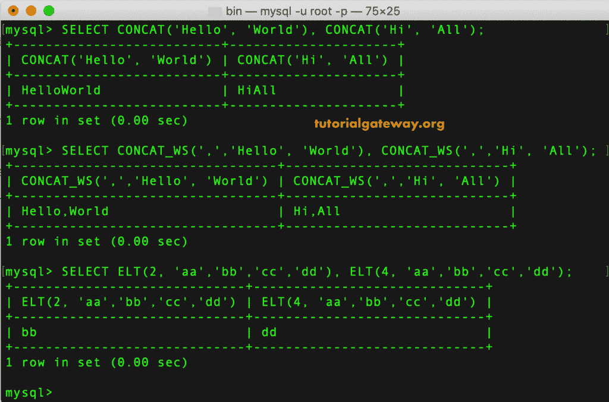
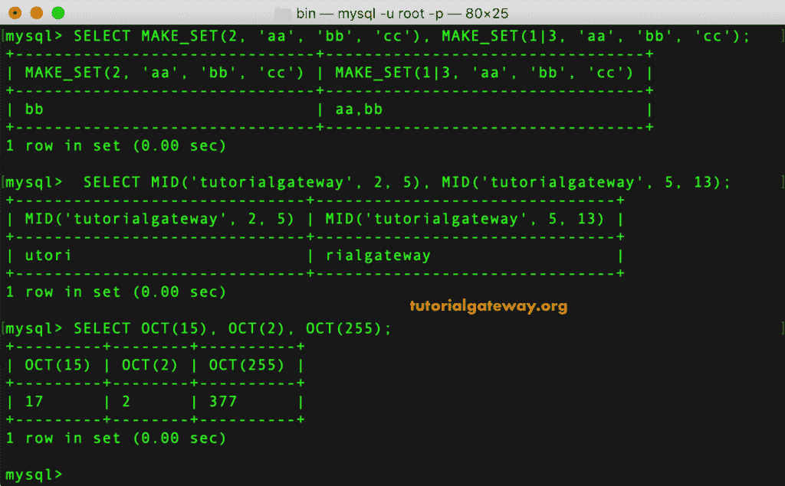

# MySQL 字符串函数

> 原文：<https://www.tutorialgateway.org/mysql-string-functions/>

MySQL 提供了各种内置的字符串函数，对字符串数据执行不同的操作。在本文中，我们向您展示了 MySQL 字符串函数的列表以及每一个函数的示例。

## MySQL 字符串函数

以下是可用于处理字符串数据的 MySQL 字符串函数列表。

| MySQL 字符串函数 | 描述 |
| ascii() | 它返回第一个或最左边字符的 ASCII 数值 |
| [BIN()](https://www.tutorialgateway.org/mysql-bin-function/) | 它返回一个包含数字的二进制表示的字符串。 |
| [BIT_LENGTH()](https://www.tutorialgateway.org/mysql-bit_length-function/) | 它以位为单位返回参数的长度 |
| [CHAR()](https://www.tutorialgateway.org/mysql-char-function/) | 返回或转换每个整数为一个字符。 |
| [CHAR_LENGTH()](https://www.tutorialgateway.org/mysql-char_length-function/) | 这个 MySQL`String()`函数返回给定参数中的字符总数。 |
| [CHARACTER_LENGTH()](https://www.tutorialgateway.org/mysql-char_length-function/) | CHAR_LENGTH()函数的同义词 |
| [CONCAT()](https://www.tutorialgateway.org/mysql-concat-string/) | 它返回串联的字符串 |
| concat _ ws() | WS 表示带分隔符。它用给定的分隔符连接字符串。 |
| [ELT()](https://www.tutorialgateway.org/mysql-elt-function/) | 它返回索引号处的字符串。 |
| [EXPORT_SET()](https://www.tutorialgateway.org/mysql-export_set-function/) | 针对值集中的每个位集返回 on 字符串，针对每个未设置的位，此函数返回 off 字符串。 |
| [FIED()](https://www.tutorialgateway.org/mysql-field-function/) | 此函数返回后续参数中第一个参数的索引位置。 |
| [FIND_IN_SET()](https://www.tutorialgateway.org/mysql-find_in_set-function/) | 它返回第一个参数在第二个参数中的索引位置。 |
| [FORMAT()](https://www.tutorialgateway.org/mysql-format-function/) | 根据用户指定的小数位数格式化数字。 |
| [HEX()](https://www.tutorialgateway.org/mysql-hex-function/) | 字符串值或十进制值的十六进制表示。 |
| [INSERT()](https://www.tutorialgateway.org/mysql-insert-function/) | 这个 MySQL`String()`函数在指定的位置插入一个子字符串，直到它达到指定的字符数。 |
| instr() | 它返回子字符串第一次出现的索引位置。 |
| lcase() | LOWER()函数的同义词。 |
| [左()](https://www.tutorialgateway.org/mysql-left-function/) | 返回用户指定的最左边的字符。 |
| [LENGTH()](https://www.tutorialgateway.org/mysql-length-function/) | 该函数以字节为单位返回长度。 |
| [喜欢](https://www.tutorialgateway.org/mysql-like-operator/) | 将此用于模式匹配 |
| 加载文件() | 它加载指定的文件。 |
| [LOCATE()](https://www.tutorialgateway.org/mysql-locate-function/) | 查找并返回单词位置的第一个匹配项。 |
| [LOWER()](https://www.tutorialgateway.org/mysql-lower-function/) | 这个`MySQL()`函数将给定的字符串转换成小写。 |
| [LPAD()](https://www.tutorialgateway.org/mysql-lpad-function/) | 它填充给定的文本并返回字符串值。 |
| [LTRIM()](https://www.tutorialgateway.org/mysql-ltrim-function/) | 删除前导空格。 |
| [MAKE_SET()](https://www.tutorialgateway.org/mysql-make_set-function/) | 它返回包含位集中相应位的逗号分隔字符串集。 |
| MATCH() | 使用此方法执行全文搜索。 |
| [MID()](https://www.tutorialgateway.org/mysql-mid-function/) | 它返回从用户给定位置开始的子字符串。 |
| 不喜欢 | 这是`LIKE()`函数的否定(简单模式匹配) |
| NOT_REGEXP | 这是一个正则表达式的否定函数 |
| [OCT()](https://www.tutorialgateway.org/mysql-oct-function/) | 它返回一个包含数字的八进制表示的字符串。 |
| [OCTET_LENGTH()](https://www.tutorialgateway.org/mysql-octet_length-function/) | LENGTH()函数的同义词 |
| [字 （T1】](https://www.tutorialgateway.org/mysql-string-ord-function/) | 这个 MySQL`String()`函数返回给定句子中最左边字符的字符代码。 |
| [位置()](https://www.tutorialgateway.org/mysql-position-function/) | LOCATE()函数的同义词 |
| [QUOTE()](https://www.tutorialgateway.org/mysql-quote-function/) | 它转义了用于 SQL 语句的参数。 |
| 正则表达式 | 字符串是否匹配正则表达式。 |
| [REPEAT()](https://www.tutorialgateway.org/mysql-repeat-function/) | 这将文本重复指定的次数。 |
| [REPLACE()](https://www.tutorialgateway.org/mysql-replace-function/) | 用指定的句子查找并替换一个单词。 |
| [REVERSE()](https://www.tutorialgateway.org/mysql-reverse-function/) | 它反转给定的字符串(总字符数) |
| [RIGHT()](https://www.tutorialgateway.org/mysql-right-function/) | 返回用户指定的最右边的字符。 |
| RLIKE | 使用此选项检查字符串是否与正则表达式匹配。 |
| [RPAD()](https://www.tutorialgateway.org/mysql-rpad-function/) | 它附加用户指定次数的文本 |
| [RTRIM()](https://www.tutorialgateway.org/mysql-rtrim-function/) | 这个 MySQL 字符串函数删除尾随空格。 |
| [SOUNDEX()](https://www.tutorialgateway.org/mysql-soundex-function/) | 这将返回一个 Soundex 字符串 |
| [听起来像](https://www.tutorialgateway.org/mysql-sounds-like-function/) | 它比较声音 |
| [SPACE()](https://www.tutorialgateway.org/mysql-space-function/) | 它提供或添加给定数量的空格。 |
| [STRCMP()](https://www.tutorialgateway.org/mysql-strcmp-function/) | 此方法比较两个字符串。 |
| [子 STR（）](https://www.tutorialgateway.org/mysql-substr-string/) | 返回给定的子字符串 |
| [SUBSTRING()](https://www.tutorialgateway.org/mysql-substring/) | 顾名思义，它返回给定字符串的子字符串 |
| [SUBSTRING_INDEX()](https://www.tutorialgateway.org/mysql-substring_index-function/) | 它返回给定字符串的子字符串。它使用分隔符和出现次数值来返回子字符串 |
| [TRIM()](https://www.tutorialgateway.org/mysql-trim-function/) | 这个`MySQL()`函数从字符串中删除前导和尾随空格。 |
| ucase() | UPPER()函数的同义词。 |
| [【unex()](https://www.tutorialgateway.org/mysql-unhex-function/) | 它返回一个包含数字十六进制表示的字符串。 |
| [UPPER()](https://www.tutorialgateway.org/mysql-upper-function/) | 此方法用于转换为大写 |

## MySQL 字符串函数示例

以下示例帮助您理解这些字符串函数。

### MySQL 字符串函数示例 1

在这个例子中，我们将使用 MySQL [ASCII](https://www.tutorialgateway.org/mysql-ascii-function/) 、 [BIN](https://www.tutorialgateway.org/mysql-bin-function/) 和 [BIT_LENGTH](https://www.tutorialgateway.org/mysql-bit_length-function/) 函数。

```
SELECT ASCII(5), ASCII('T'), ASCII('Tut'), ASCII('a');

SELECT BIN(10), BIN(25), BIN(34), BIN(8), BIN(4);

SELECT BIT_LENGTH('Hi'), BIT_LENGTH('Tutorial');
```


在这个例子中，我们使用了 MySQL [CHAR](https://www.tutorialgateway.org/mysql-char-function/) 、 [CHAR_LENGTH](https://www.tutorialgateway.org/mysql-char_length-function/) 和 [CHARACTER_LENGTH](https://www.tutorialgateway.org/mysql-char_length-function/) 方法来查找 ASCII 码的字符，即 [MySQL](https://www.tutorialgateway.org/mysql-tutorial/) 中的字符长度。

```
SELECT CHAR(84), CHAR(77, 121, 83, 81, 76), CHAR(72, 105);

SELECT CHAR_LENGTH('Hi'), CHAR_LENGTH('MySQL');

SELECT CHARACTER_LENGTH('Hello'), CHARACTER_LENGTH('Tutorial');
```


### MySQL 字符串函数示例 3

在这个例子中，我们使用了 [CONCAT](https://www.tutorialgateway.org/mysql-concat-string/) 和 [CONCAT_WS](https://www.tutorialgateway.org/mysql-concat_ws-string/) 方法来连接多个字符串值。接下来，我们使用 [ELT](https://www.tutorialgateway.org/mysql-elt-function/) 在指定的索引处查找单词。

```
SELECT CONCAT('Hello', 'World'), CONCAT('Hi', 'All');

SELECT CONCAT_WS(',','Hello', 'World'), CONCAT_WS(',','Hi', 'All');

SELECT ELT(2, 'aa','bb','cc','dd'), ELT(4, 'aa','bb','cc','dd');
```



在这个例子中，我们将使用 MySQL [EXPORT_SET](https://www.tutorialgateway.org/mysql-export_set-function/) 、 [FIELD](https://www.tutorialgateway.org/mysql-field-function/) 和 [FIND_IN_SET](https://www.tutorialgateway.org/mysql-find_in_set-function/) 函数。

```
SELECT EXPORT_SET(5, 'Y', 'N', ',', 4), EXPORT_SET(5, 'Y', 'N', '-', 6);

SELECT FIELD('abc', 'xyz', 'abc', 'Hi', 'you', 'abc');

SELECT FIND_IN_SET('x', 'a,b,c,x,d,e'), FIND_IN_SET('x', 'a,x,c,x,d,e');
```


### MySQL 字符串函数示例 5

在这个例子中，我们使用了 MySQL [FORMAT](https://www.tutorialgateway.org/mysql-format-function/) 函数来格式化该值， [HEX](https://www.tutorialgateway.org/mysql-hex-function/) 来查找十六进制值。接下来，我们使用`INSERT()`函数插入子字符串。

```
SELECT FORMAT(98765.126349, 3), FORMAT(98765.126349, 2, 'ru_RU');

SELECT HEX('Hi'), HEX(25), HEX(255), HEX(495), HEX(1235);

SELECT INSERT('TutorialGateway', 4, 2, 'aaa');
```


在这种情况下，我们使用这个 MySQL [INSTR](https://www.tutorialgateway.org/mysql-instr-string/) 方法来查找子串第一次出现的索引位置。接下来，我们使用 MySQL [LCASE](https://www.tutorialgateway.org/mysql-lcase-function/) 将文本转换为小写， [LEFT](https://www.tutorialgateway.org/mysql-left-function/) 查找字符串中最左边的字符。

```
SELECT INSTR('hiabcatabc', 'abc'), INSTR('we abc at abc in xyz', 'abc');

SELECT LCASE('Hi GuYS'), LCASE('MySQL'), LCASE('SUResH');

SELECT LEFT('tutorialgateway', 8), LEFT('tutorialgateway', 12);
```


在这个例子中，我们使用 [LENGTH](https://www.tutorialgateway.org/mysql-length-function/) 函数来计算字符串长度。接下来，我们使用[定位](https://www.tutorialgateway.org/mysql-locate-function/)来查找子串第一次出现的索引位置。在最后一条语句中， [LOWER](https://www.tutorialgateway.org/mysql-lower-function/) 函数将给定的句子转换成小写。

```
SELECT LENGTH('hello'), LENGTH('Hello world');

SELECT LOCATE('at','abcatabc'), LOCATE('abc','we abc at abc in xyz', 7);

SELECT LOWER('HELLO WoRLd'), LOWER('MySQL TUTORIAL'), LOWER('SUResH');
```


### MySQL 字符串函数示例 8

在这个例子中，我们使用 MySQL [LPAD](https://www.tutorialgateway.org/mysql-lpad-function/) 将子字符串追加到句子的左侧，使用 [LTRIM](https://www.tutorialgateway.org/mysql-ltrim-function/) 删除前导空格。接下来，我们使用 MySQL [RTRIM](https://www.tutorialgateway.org/mysql-rtrim-function/) 删除尾随空格。

```
SELECT LPAD('MySQL', 7, 'Hi'), LPAD('MySQL', 3, 'Hi');

SELECT LTRIM('    Hi'), LTRIM('          MySQL');

SELECT RTRIM('Hello   '), RTRIM('MySQL         ');
```


在这个 MySQL 字符串函数的例子中，我们使用了`MAKE_SET()`函数、 [MID](https://www.tutorialgateway.org/mysql-mid-function/) 和 [OCT](https://www.tutorialgateway.org/mysql-oct-function/) 函数。

```
SELECT MAKE_SET(2, 'aa', 'bb', 'cc'), MAKE_SET(1|3, 'aa', 'bb', 'cc');

SELECT MID('tutorialgateway', 2, 5), MID('tutorialgateway', 5, 13);

SELECT OCT(15), OCT(2), OCT(255);
```



### MySQL 字符串函数示例 10

在这个例子中，我们使用 MySQL [REPEAT](https://www.tutorialgateway.org/mysql-repeat-function/) 来重复 <font color="# 000000">sen</font> tence、 [REPLACE](https://www.tutorialgateway.org/mysql-replace-function/) 函数来用一个新的子串替换这个单词。接下来，我们使用 [REVERSE](https://www.tutorialgateway.org/mysql-reverse-function/) 功能来反转给定的句子。

```
SELECT REPEAT('MySQL', 2), REPEAT('Hello', 5);

SELECT REPLACE('hello', 'l', 'd'), REPLACE('tutorialgateway', 't', 'AA');

SELECT REVERSE('hello'), REVERSE('MySQL'), REVERSE('Suresh');
```


### MySQL 字符串函数示例 11

在本例中，我们将使用 [RIGHT](https://www.tutorialgateway.org/mysql-right-function/) 函数查找最右边的字符，使用 [RPAD](https://www.tutorialgateway.org/mysql-rpad-function/) 将子字符串追加到右侧。接下来，我们使用 [SOUNDEX](https://www.tutorialgateway.org/mysql-soundex-function/) 来查找给定文本的 SOUNDEX 值。

```
SELECT RIGHT('tutorialgateway', 4), RIGHT('tutorialgateway', 10);

SELECT RPAD('MySQL', 10, 'Hello'), RPAD('MySQL', 3, 'Hi');

SELECT SOUNDEX('Hello'), SOUNDEX('MySQL');
```


在这个场景中，我们使用 MySQL [SPACE](https://www.tutorialgateway.org/mysql-space-function/) 来生成空白空间。接下来，我们使用 MySQL [SUBSTR](https://www.tutorialgateway.org/mysql-substr-string/) 和 [SUBSTRING](https://www.tutorialgateway.org/mysql-substring/) 返回给定文本的子字符串。

```
SELECT SPACE(5), CONCAT('Learn', SPACE(2), 'MySQL');

SELECT SUBSTR('tutorialgateway', 9), SUBSTR('MySQL Tutorial', 3, 9);

SELECT SUBSTRING('tutorialgateway', 9), SUBSTRING('MySQL Tutorial', 3, 9);
```


### MySQL 字符串函数示例 13

在这个例子中，我们使用了 MySQL [TRIM](https://www.tutorialgateway.org/mysql-trim-function/) 来移除前导和尾随空格。接下来，MySQL [UCASE](https://www.tutorialgateway.org/mysql-ucase-function/) 将文本转换为大写，而 [SUBSTRING_INDEX](https://www.tutorialgateway.org/mysql-substring_index-function/) 将返回子字符串到指定分隔符的索引位置。

```
SELECT SUBSTRING_INDEX('hi,how are,you', ',', 2);

SELECT TRIM('   hi   '), TRIM(BOTH 'A' FROM 'AAAAhello worldAAAA');

SELECT UCASE('suREsh'), UCASE('TutoriALgatEway');
```


在这里，我们使用 MySQL[UNHX](https://www.tutorialgateway.org/mysql-unhex-function/)从十六进制数返回文本。接下来，我们使用 MySQL [UPPER](https://www.tutorialgateway.org/mysql-upper-function/) 将文本转换为大写。最后一个[引号](https://www.tutorialgateway.org/mysql-quote-function/)语句是跳过或转义特殊字符。

```
SELECT UNHEX('4869'), UNHEX('255'), UNHEX('4D7953514C');

SELECT UPPER('Hi'), UPPER('HeLlo world'), UPPER('mysql');

SELECT QUOTE('Don\'t Worry!');
```

