# MySQL 数值函数

> 原文：<https://www.tutorialgateway.org/mysql-numeric-functions/>

MySQL 提供了各种内置的数学或数值函数，以及三角函数来对数值数据执行不同的操作。在本研究中，我们向您展示了 MySQL 数值函数和三角函数的列表，并给出了它们各自的示例。

## MySQL 数值函数

以下是可用于处理数值数据的 MySQL 数学和三角函数列表。

| MySQL 数值函数 | 描述 |
| [ABS()](https://www.tutorialgateway.org/mysql-abs-function/) | 这将返回绝对正值 |
| acos() | 这个 MySQL 数值函数返回弧余弦值。 |
| [ASIN()](https://www.tutorialgateway.org/mysql-asin-fnction/) | 这个 MySQL 三角函数返回反正弦 |
| [阿坦()](https://www.tutorialgateway.org/mysql-atan-function/) | 它返回反正切值。 |
| [ATAN2()](https://www.tutorialgateway.org/mysql-atan2-function/) | 返回两个参数的反正切值。 |
| [CEIL()](https://www.tutorialgateway.org/mysql-ceiling-function/) | 它返回不小于给定值的最小整数值。 |
| [天花板()](https://www.tutorialgateway.org/mysql-ceiling-function/) | 返回不小于给定值的最小整数。 |
| [CONV()](https://www.tutorialgateway.org/mysql-conv-function/) | 在不同的基数之间转换给定的数字。 |
| [COS()](https://www.tutorialgateway.org/mysql-cos-function/) | 这个 MySQL 数值函数返回给定值的余弦值。 |
| [COT()](https://www.tutorialgateway.org/mysql-cot-function/) | 返回余切值 |
| [CRC32()](https://www.tutorialgateway.org/mysql-crc32-function/) | 循环冗余校验值。 |
| [DEVELOPES()](https://www.tutorialgateway.org/mysql-degrees-function/) | 它将弧度值转换为度数 |
| [EXP()](https://www.tutorialgateway.org/mysql-exp-function/) | 提高到...的力量 |
| [FLOOR()](https://www.tutorialgateway.org/mysql-floor-function/) | 它返回不大于给定值的最大整数值。 |
| ln() | [MySQL](https://www.tutorialgateway.org/mysql-tutorial/) 日志功能的同义词 |
| 日志() | 返回自然对数值。 |
| [LOG10()](https://www.tutorialgateway.org/mysql-log10-function/) | 这个 MySQL 数值函数返回给定参数的对数十进制值。 |
| [LOG2()](https://www.tutorialgateway.org/mysql-log2-function/) | 返回对数基数为 2 的值 |
| [模式()](https://www.tutorialgateway.org/mysql-mod-function/) | 返回余数。 |
| [PI](https://www.tutorialgateway.org/mysql-pi-function/) | 用这个得到 PI 值(3.14) |
| [POW()](https://www.tutorialgateway.org/mysql-pow-function/) | 它返回提升到指定幂的参数。 |
| [POWER()](https://www.tutorialgateway.org/mysql-power-function/) | 查找提升到指定幂的给定值。 |
| [RADIANS()](https://www.tutorialgateway.org/mysql-radians-function/) | 它将度数值转换为弧度 |
| [RAND()](https://www.tutorialgateway.org/mysql-rand-function/) | 它返回随机浮点值。 |
| [ROUND()](https://www.tutorialgateway.org/mysql-round-function/) | 这个 MySQL 数值函数对给定值进行舍入。 |
| [SIGN()](https://www.tutorialgateway.org/mysql-sign-function/) | 它返回参数的符号(正，负) |
| [SIN()](https://www.tutorialgateway.org/mysql-sin-function/) | 返回给定参数的正弦值。 |
| [SQRT()](https://www.tutorialgateway.org/mysql-sqrt-function/) | 查找给定值的平方根 |
| [TAN()](https://www.tutorialgateway.org/mysql-tan-function/) | 返回正切值 |
| [TRUNCATE()](https://www.tutorialgateway.org/mysql-truncate-function/) | 它将给定值截断到用户指定的小数位。 |

## MySQL 数值函数示例

下面的例子帮助你理解 MySQL 中的这些数学函数

### MySQL 三角函数示例 1

在这个例子中，我们将使用 MySQL [ABS](https://www.tutorialgateway.org/mysql-abs-function/) 函数来寻找绝对正值。接下来，我们使用 MySQL [ACOS](https://www.tutorialgateway.org/mysql-acos-function/) 、 [ASIN](https://www.tutorialgateway.org/mysql-asin-fnction/) 函数来查找弧余弦值和弧正弦值。

```sql
SELECT ABS(10), ABS(-32), ABS(-44), ABS(-23.32);

SELECT ACOS(1), ACOS(0), ACOS(0.5), ACOS(0.75);

SELECT ASIN(0), ASIN(0.25), ASIN(0.50), ASIN(1);
```

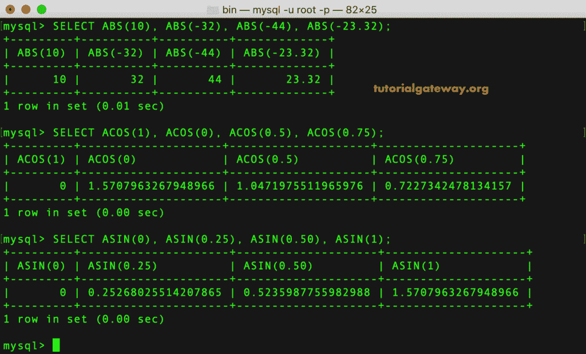

### MySQL 三角函数示例 2

在这个 MySQL 三角函数的例子中，我们将使用 [ATAN](https://www.tutorialgateway.org/mysql-atan-function/) 和 [ATAN2](https://www.tutorialgateway.org/mysql-atan2-function/) 函数来寻找单参数和双参数的反正切值。接下来，我们使用 [COS](https://www.tutorialgateway.org/mysql-cos-function/) 函数来寻找余弦值。

```sql
SELECT ATAN(4), ATAN(24), ATAN(-32);

SELECT ATAN2(1, 5), ATAN2(-2, 3), ATAN(3.5, 0);

SELECT COS(0), COS(1), COS(2.5), COS(0.25);
```

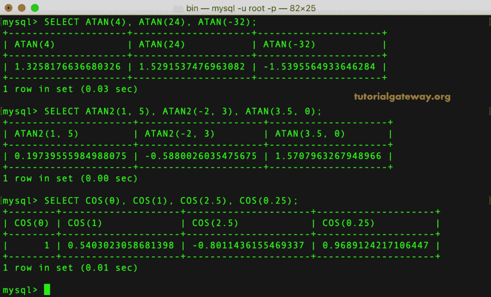

### MySQL 数值函数示例 3

在这个例子中，我们将使用 MySQL CEIL，[天花板](https://www.tutorialgateway.org/mysql-ceiling-function/)函数来寻找最接近的值。接下来，我们应用 [CONV](https://www.tutorialgateway.org/mysql-conv-function/) 函数根据给定的基数转换给定值。

```sql
SELECT CEIL(1.25), CEIL(1.95), CEIL(-2.3), CEIL(-2.90);

SELECT CEILING(7.98), CEILING(6.01), CEILING(-22.93);

SELECT CONV('A', 16, 2), CONV('G', 18, 8);
```

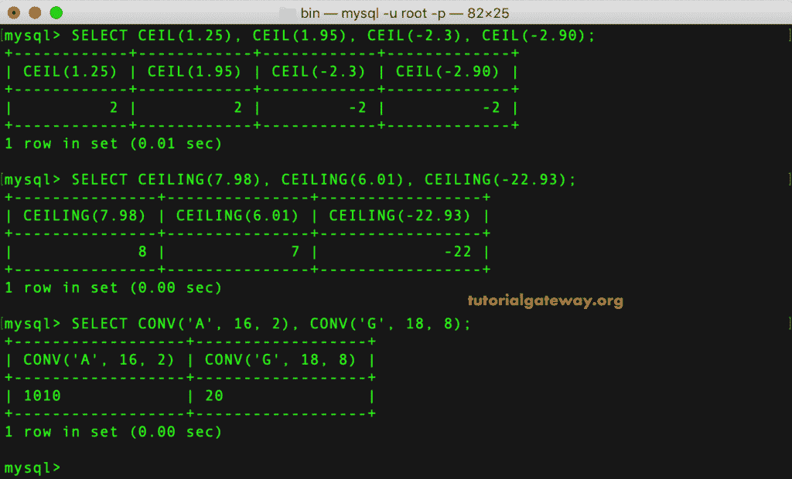

### MySQL 数值函数示例 4

在这个例子中，我们将使用 MySQL [COT](https://www.tutorialgateway.org/mysql-cot-function/) 、 [DEGREES](https://www.tutorialgateway.org/mysql-degrees-function/) 和 [EXP](https://www.tutorialgateway.org/mysql-exp-function/) 数学函数。

```sql
SELECT COT(5), COT(1), COT(15);

SELECT DEGREES(3.14), DEGREES(PI() / 2), DEGREES(2);

SELECT EXP(0), EXP(2), EXP(-2);
```

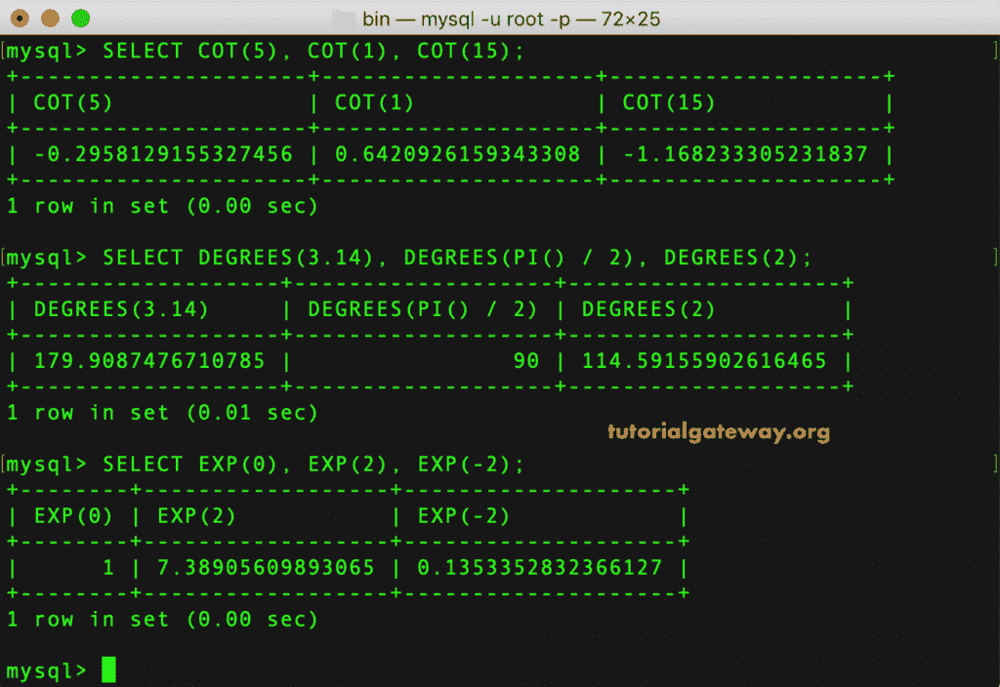

### MySQL 数学函数示例 5

在这个 MySQL 数学函数示例中，我们将应用 [EXP](https://www.tutorialgateway.org/mysql-exp-function/) 、 [FLOOR](https://www.tutorialgateway.org/mysql-floor-function/) 和`FORMAT()`函数。

```sql
SELECT EXP(0), EXP(2), EXP(-2);

SELECT FLOOR(2.89), FLOOR(2.05), FLOOR(-2.25), FLOOR(-2.97);

SELECT FORMAT(543212.1245, 2), FORMAT(1121343.87965, 4);
```

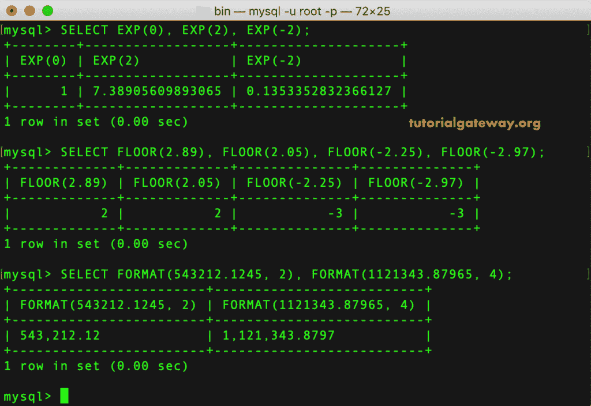

### MySQL 数学函数示例 6

在这个 MySQL 数学函数的例子中，我们将练习 [LN](https://www.tutorialgateway.org/mysql-ln-function/) 、 [LOG](https://www.tutorialgateway.org/mysql-log-function/) 、 [LOG2](https://www.tutorialgateway.org/mysql-log2-function/) 函数来寻找自然对数值，以及 Log base 2 值。

```sql
SELECT LN(2), LN(5), LN(-5);

SELECT LOG(2), LOG(2, 250), LOG(10, 250);

SELECT LOG2(250), LOG2(24567), LOG2(-23234);
```

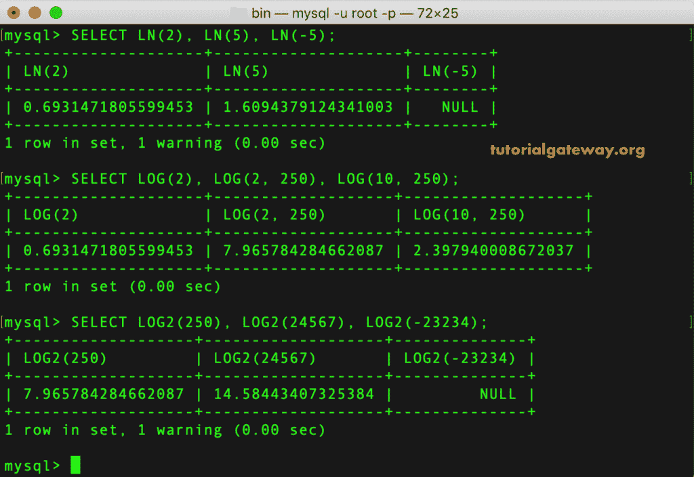

### MySQL 数值函数示例 7

这里我们要用 MySQL [LOG10](https://www.tutorialgateway.org/mysql-log10-function/) 函数求基数 10 的对数值。接下来，MySQL [MOD](https://www.tutorialgateway.org/mysql-mod-function/) 求余数， [PI](https://www.tutorialgateway.org/mysql-pi-function/) 函数求 PI 值。

```sql
SELECT LOG10(250), LOG10(1000), LOG10(2500);

SELECT MOD(250, 7), MOD(59, 9), 600 MOD 16;

SELECT PI(), PI() MOD 2;
```

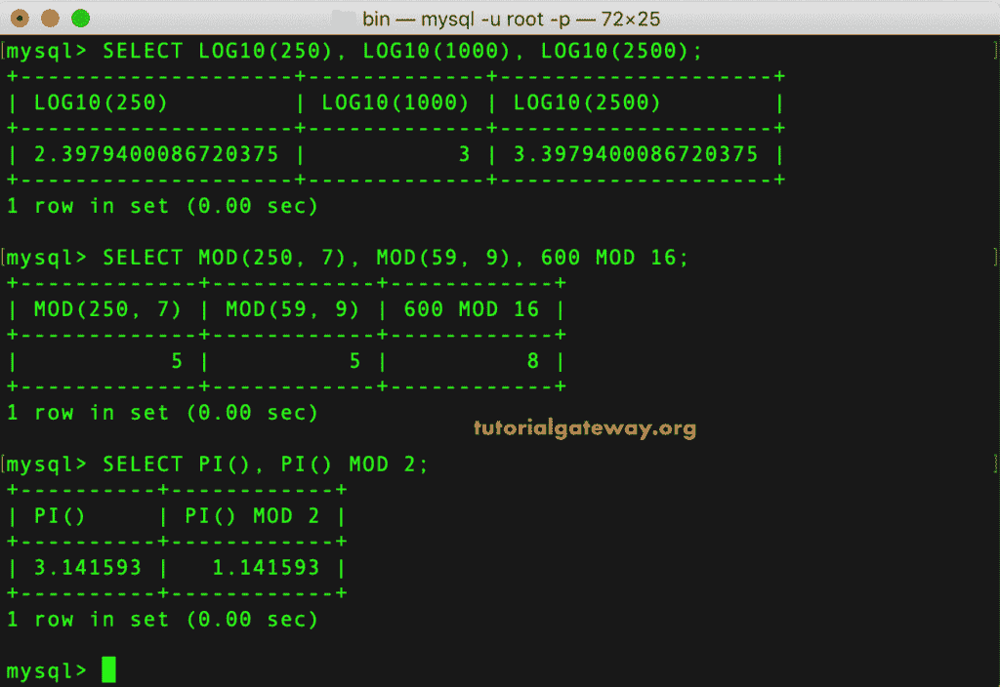

### MySQL 数学函数示例 8

在这个 MySQL 数学函数的例子中，我们使用 [POW](https://www.tutorialgateway.org/mysql-pow-function/) 、[POW](https://www.tutorialgateway.org/mysql-power-function/)函数来寻找 POWER。接下来，我们应用 MySQL [弧度](https://www.tutorialgateway.org/mysql-radians-function/)将度数转换为弧度。

```sql
SELECT POW(3, 2), POW(25, 5), POW(16, 2);

SELECT POWER(3, 2), POWER(25, 5), POWER(16, 2);

SELECT RADIANS(90), RADIANS(180), RADIANS(360);
```

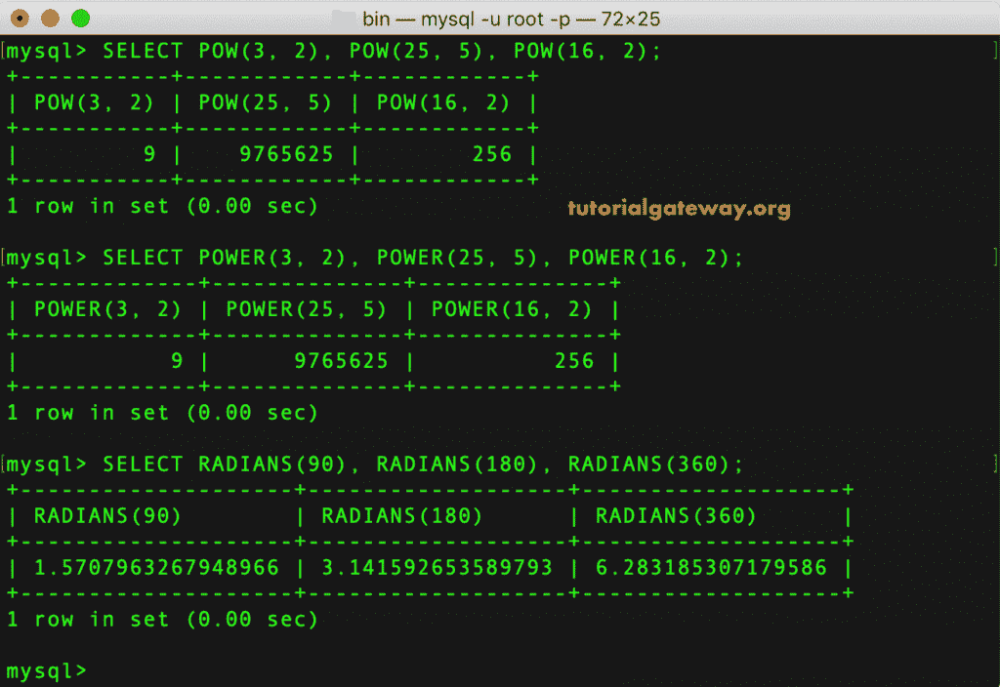

### MySQL 数学函数示例 9

在这个 MySQL 数学函数的例子中，我们将使用 [RAND](https://www.tutorialgateway.org/mysql-rand-function/) 返回随机值， [SIGN](https://www.tutorialgateway.org/mysql-sign-function/) 函数查找符号。接下来，我们使用 MySQL [ROUND](https://www.tutorialgateway.org/mysql-round-function/) 函数对小数进行舍入。

```sql
SELECT RAND(), RAND(5);

SELECT ROUND(-12.25), ROUND(-12.67), ROUND(14.268, 1);

SELECT SIGN(-12), SIGN(12), SIGN(0);
```

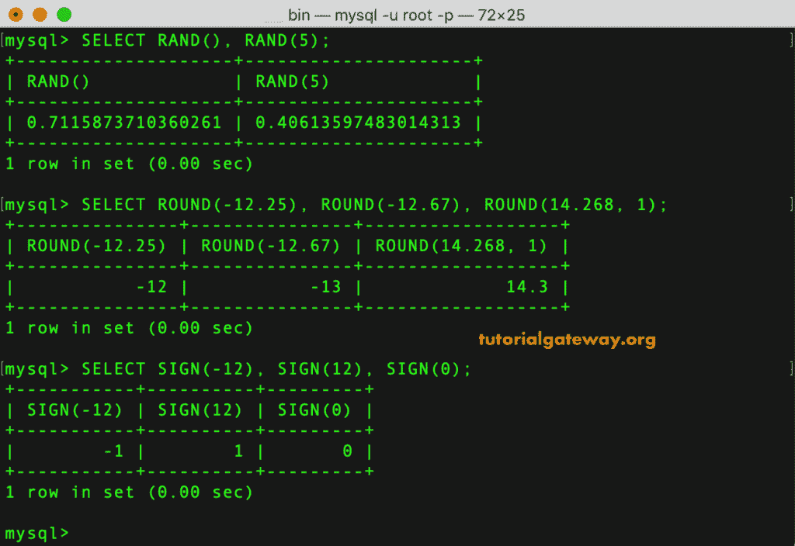

### MySQL 数值函数示例 10

在这个例子中，我们将使用 MySQL [SIN](https://www.tutorialgateway.org/mysql-sin-function/) 、 [TAN](https://www.tutorialgateway.org/mysql-tan-function/) 函数来寻找正弦值、正切值。接下来，我们使用 MySQL [SQRT](https://www.tutorialgateway.org/mysql-sqrt-function/) 函数来求给定值的平方根。

```sql
SELECT SIN(0), SIN(2.5), SIN(1);

SELECT TAN(3.14), TAN(1), TAN(0);

SELECT SQRT(16), SQRT(25), SQRT(894);
```

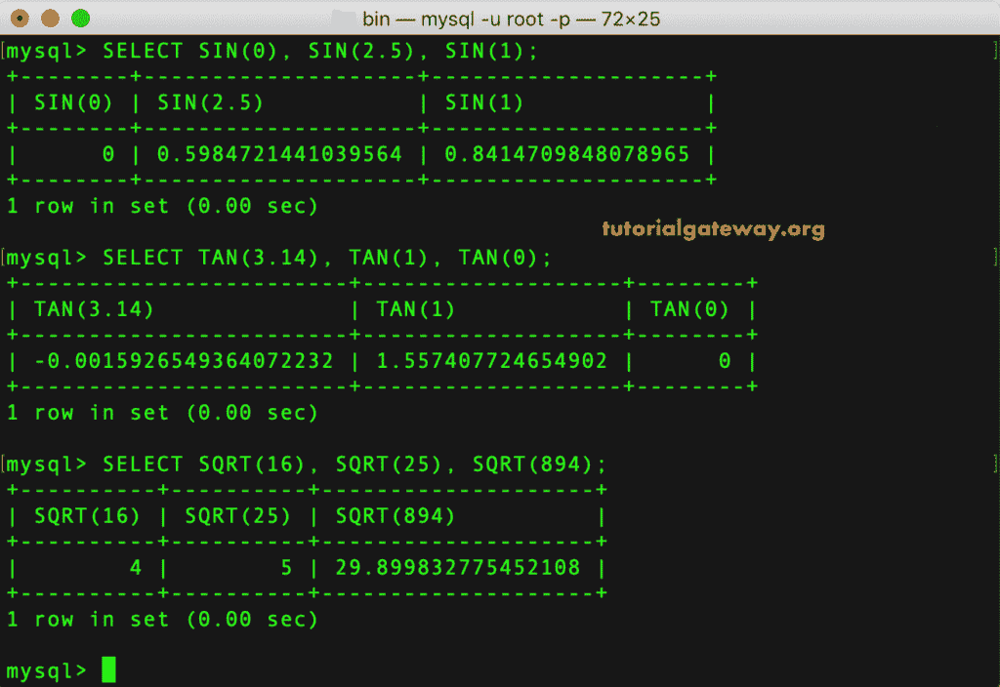

### MySQL 数学函数示例 11

我们将使用 MySQL [TRUNCATE](https://www.tutorialgateway.org/mysql-truncate-function/) 和 HEX 数学函数。

```sql
SELECT TRUNCATE(10.9876, 1), TRUNCATE(10.9876, 0);

SELECT HEX(255), HEX('Hi'), HEX('Hello');
```

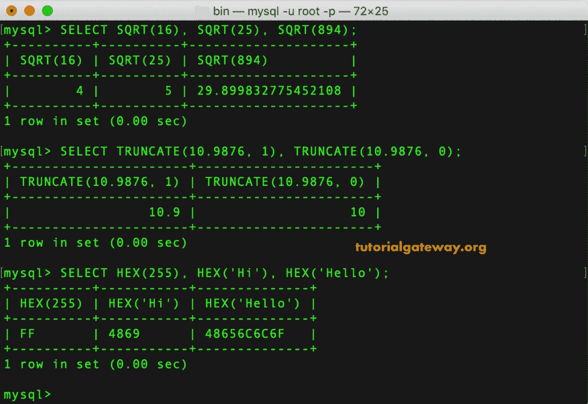